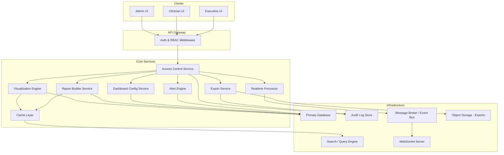
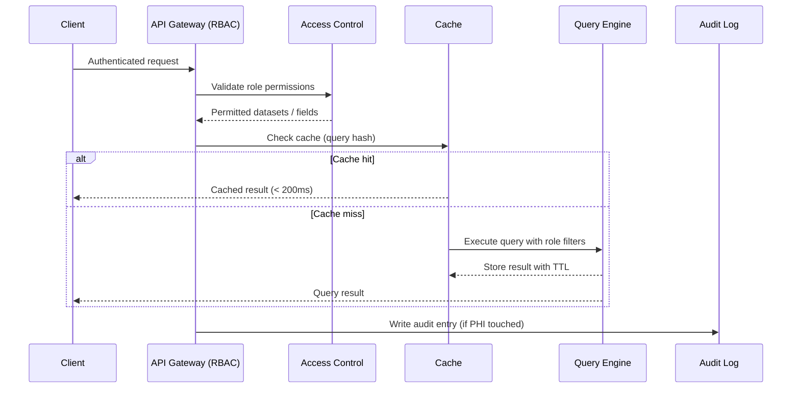

# Design Document: Analytics Dashboard Enhancement

## Overview

The Analytics Dashboard Enhancement delivers a HIPAA-compliant, high-performance analytics platform for healthcare administrators, clinical staff, and executives. It extends the existing dashboard with seven major capability areas: role-based data access enforcement, advanced interactive visualizations (7+ chart types, cross-filtering, drill-down), a custom report builder with scheduling, multi-format data export, real-time streaming analytics, dashboard layout customization with alert thresholds, and performance optimization for datasets up to 1 million records and 200 concurrent users.

All data access is mediated by a centralized Access Control layer that enforces role-based permissions and HIPAA compliance. Every PHI-touching action is recorded in an immutable audit log. The system is designed for a 3-second initial load, sub-200ms cached query responses, and graceful degradation under load.

### Key Design Goals

- Centralized RBAC enforcement across all data paths: queries, visualizations, exports, and streaming
- Immutable, append-only audit log for all PHI access, export, and modification events
- Interactive visualization engine with cross-filtering, drill-down, and 7+ chart types
- Flexible report builder with saved configurations, scheduling, and role-aware field filtering
- Multi-format export (CSV, XLSX, PDF) with PHI classification labeling and async delivery for large sets
- Real-time streaming with buffering, reconnection, and role-filtered push updates
- Drag-and-drop dashboard customization with persistent layouts and alert threshold configuration
- Query result caching with configurable TTL, pagination for large tables, and query cancellation

---

## Architecture

The system follows a layered service architecture. All client requests pass through an API Gateway that enforces authentication and RBAC before reaching domain services. An event bus decouples the real-time processor from the rest of the system.



### Request Lifecycle



---

## Components and Interfaces

### Access Control Service

Central RBAC enforcer. All data requests pass through this service to resolve permitted datasets and fields for the requesting user's role.

```typescript
interface AccessControlService {
  getPermittedDatasets(userId: string): Promise<DatasetPermission[]>;
  getPermittedFields(userId: string, datasetId: string): Promise<string[]>;
  assertPermission(userId: string, datasetId: string): Promise<void>; // throws AuthorizationError
  isSessionValid(sessionId: string): Promise<boolean>;
  getRoleForUser(userId: string): Promise<Role>;
}

interface DatasetPermission {
  datasetId: string;
  aggregationLevel: 'patient' | 'facility' | 'provider' | 'system';
  allowedOperations: ('read' | 'export' | 'drill_down')[];
}

type Role = 'Administrator' | 'Clinician' | 'Executive';
```

### Visualization Engine

Renders chart configurations and computes tooltip data. Does not hold state — it transforms data into render-ready structures. Cross-filter state is managed by the Dashboard Config Service.

```typescript
interface VisualizationEngine {
  renderChart(config: ChartConfig, data: DataSet, roleContext: RoleContext): ChartRenderResult;
  computeTooltip(dataPoint: DataPoint, config: ChartConfig): TooltipData;
  applyFilter(viewId: string, filter: CrossFilter): FilteredViewState;
  drillDown(dataPoint: DataPoint, roleContext: RoleContext): Promise<DrillDownResult>;
}

interface ChartConfig {
  chartType: ChartType;
  datasetId: string;
  xAxis: string;
  yAxis: string;
  groupBy?: string;
  filters: FilterSpec[];
}

type ChartType = 'line' | 'bar' | 'stacked_bar' | 'pie' | 'scatter' | 'heatmap' | 'geo_map';

interface TooltipData {
  label: string;
  value: number | string;
  metadata: Record<string, string>;
}

interface CrossFilter {
  sourceVisualizationId: string;
  dimension: string;
  selectedValues: (string | number)[];
}

interface DrillDownResult {
  records: Record<string, unknown>[];
  aggregationLevel: 'patient' | 'facility' | 'provider' | 'system';
  restrictedByRole: boolean;
}
```

### Report Builder Service

Manages report configuration lifecycle: creation, persistence, execution, scheduling, and sharing.

```typescript
interface ReportBuilderService {
  createReport(userId: string, config: ReportConfig): Promise<ReportDefinition>;
  saveReport(userId: string, report: ReportDefinition): Promise<void>;
  loadReport(userId: string, reportId: string): Promise<ReportDefinition>;
  runReport(userId: string, reportId: string): Promise<ReportResult>;
  scheduleReport(userId: string, reportId: string, schedule: ReportSchedule): Promise<void>;
  shareReport(ownerId: string, reportId: string, targetUserId: string): Promise<void>;
  listReports(userId: string): Promise<ReportDefinition[]>;
}

interface ReportConfig {
  dataSources: string[];
  metrics: MetricSpec[];
  dimensions: DimensionSpec[];
  filters: FilterSpec[];
}

interface ReportDefinition {
  id: string;
  ownerId: string;
  ownerRole: Role;
  name: string;
  config: ReportConfig;
  restrictedFieldsOmitted: string[];  // fields excluded due to role
  createdAt: Date;
  updatedAt: Date;
}

interface ReportSchedule {
  interval: 'daily' | 'weekly' | 'monthly';
  nextRunAt: Date;
  notifyOnCompletion: boolean;
}

interface ReportResult {
  reportId: string;
  executedAt: Date;
  rows: Record<string, unknown>[];
  omittedFields: string[];  // role-restricted fields excluded from results
}
```

### Export Service

Generates export files in CSV, XLSX, and PDF formats. Applies role-based field filtering and embeds classification labels. Large exports are handled asynchronously.

```typescript
interface ExportService {
  initiateExport(userId: string, request: ExportRequest): Promise<ExportJob>;
  getExportStatus(jobId: string): Promise<ExportJob>;
  downloadExport(jobId: string, userId: string): Promise<ReadableStream>;
  cancelExport(jobId: string): Promise<void>;
}

interface ExportRequest {
  sourceType: 'report' | 'visualization';
  sourceId: string;
  format: ExportFormat;
  filters?: FilterSpec[];
}

type ExportFormat = 'csv' | 'xlsx' | 'pdf';

interface ExportJob {
  id: string;
  userId: string;
  format: ExportFormat;
  status: 'pending' | 'processing' | 'complete' | 'failed';
  rowCount?: number;
  estimatedCompletionAt?: Date;
  downloadUrl?: string;
  errorMessage?: string;
  createdAt: Date;
  completedAt?: Date;
}
```

### Realtime Processor

Ingests streaming data events, applies role-based filters, and pushes updates to connected dashboard clients via WebSocket. Supports pause/resume with buffering.

```typescript
interface RealtimeProcessor {
  connect(userId: string, sessionId: string): Promise<StreamConnection>;
  disconnect(userId: string, sessionId: string): Promise<void>;
  pauseStream(userId: string, sessionId: string): Promise<void>;
  resumeStream(userId: string, sessionId: string): Promise<BatchUpdate>;
  getConnectionStatus(sessionId: string): StreamStatus;
}

interface StreamConnection {
  sessionId: string;
  connectedAt: Date;
  lastUpdateAt: Date | null;
  status: 'connected' | 'disconnected' | 'reconnecting';
}

interface StreamStatus {
  connected: boolean;
  lastUpdateAt: Date | null;
  bufferedUpdateCount: number;
}

interface BatchUpdate {
  updates: StreamEvent[];
  appliedAt: Date;
}
```

### Dashboard Config Service

Persists and restores user dashboard layouts, named views, and alert threshold configurations.

```typescript
interface DashboardConfigService {
  saveLayout(userId: string, viewId: string, layout: DashboardLayout): Promise<void>;
  loadLayout(userId: string, viewId: string): Promise<DashboardLayout>;
  listViews(userId: string): Promise<DashboardView[]>;
  createView(userId: string, name: string): Promise<DashboardView>;
  publishTemplate(adminUserId: string, viewId: string): Promise<void>;
  setAlertThreshold(userId: string, config: AlertThresholdConfig): Promise<void>;
  getAlertThresholds(userId: string): Promise<AlertThresholdConfig[]>;
}

interface DashboardLayout {
  viewId: string;
  widgets: WidgetPlacement[];
  updatedAt: Date;
}

interface WidgetPlacement {
  widgetId: string;
  chartType: ChartType;
  x: number;
  y: number;
  width: number;
  height: number;
}

interface AlertThresholdConfig {
  id: string;
  userId: string;
  metricId: string;
  threshold: number;
  direction: 'above' | 'below';
  notificationEnabled: boolean;
}
```

### Cache Layer

Wraps the query engine with a TTL-based cache keyed on query hash + role context.

```typescript
interface CacheLayer {
  get(key: string): Promise<CachedResult | null>;
  set(key: string, value: unknown, ttlSeconds: number): Promise<void>;
  invalidate(key: string): Promise<void>;
  buildKey(query: QuerySpec, roleContext: RoleContext): string;
}

interface CachedResult {
  data: unknown;
  cachedAt: Date;
  ttlSeconds: number;
  expiresAt: Date;
}
```

### Audit Log Store

Append-only store for all PHI-touching events. No update or delete operations are permitted.

```typescript
interface AuditLogStore {
  append(entry: AuditLogEntry): Promise<void>;
  query(filter: AuditFilter): Promise<AuditLogEntry[]>;
}

interface AuditLogEntry {
  id: string;
  userId: string;
  action: AuditAction;
  resourceType: 'query' | 'export' | 'report' | 'visualization';
  resourceId: string;
  affectedRecordIds: string[];
  timestamp: Date;
  exportFormat?: ExportFormat;
  dataScope?: string;
  rowCount?: number;
  ipAddress: string;
  sessionId: string;
}

type AuditAction = 'accessed' | 'exported' | 'modified' | 'drill_down';
```

---

## Data Models

### User and Role

```typescript
interface User {
  id: string;
  email: string;
  role: Role;
  sessionId: string | null;
  sessionExpiresAt: Date | null;
  createdAt: Date;
}

// Role permission matrix
const ROLE_PERMISSIONS: Record<Role, DatasetPermission[]> = {
  Administrator: [
    { datasetId: '*', aggregationLevel: 'patient', allowedOperations: ['read', 'export', 'drill_down'] }
  ],
  Clinician: [
    { datasetId: 'patient_records', aggregationLevel: 'patient', allowedOperations: ['read', 'drill_down'] },
    { datasetId: 'provider_metrics', aggregationLevel: 'provider', allowedOperations: ['read', 'export'] }
  ],
  Executive: [
    { datasetId: '*', aggregationLevel: 'facility', allowedOperations: ['read', 'export'] }
  ]
};
```

### Report and Schedule

```typescript
interface ScheduledReportRun {
  id: string;
  reportId: string;
  scheduledFor: Date;
  executedAt: Date | null;
  status: 'pending' | 'running' | 'complete' | 'failed';
  resultRowCount: number | null;
  notificationSent: boolean;
}
```

### Dashboard View

```typescript
interface DashboardView {
  id: string;
  userId: string;
  name: string;
  isTemplate: boolean;          // published by admin as default
  templateRole?: Role;          // role this template applies to
  layout: DashboardLayout;
  createdAt: Date;
  updatedAt: Date;
}
```

### Stream Event

```typescript
interface StreamEvent {
  id: string;
  datasetId: string;
  eventType: 'insert' | 'update' | 'delete';
  payload: Record<string, unknown>;
  occurredAt: Date;
  receivedAt: Date;
}
```

### Export File Metadata

```typescript
interface ExportFileMetadata {
  jobId: string;
  format: ExportFormat;
  classificationLabel: string;  // "CONFIDENTIAL – HIPAA Protected"
  containsPHI: boolean;
  rowCount: number;
  generatedAt: Date;
  storagePath: string;          // object storage path, deleted on failure
}
```

### Cache Key Schema

Cache keys are structured as `{featureName}:{roleHash}:{queryHash}` to ensure role isolation:

```
analytics:{sha256(role+permissions)}:{sha256(querySpec)}
```

---

## Correctness Properties

*A property is a characteristic or behavior that should hold true across all valid executions of a system — essentially, a formal statement about what the system should do. Properties serve as the bridge between human-readable specifications and machine-verifiable correctness guarantees.*

### Property 1: RBAC Data Filtering — Static, Visualization, and Streaming

*For any* user and any data request (query, visualization render, or streaming event push), the returned data should contain only records and fields from datasets permitted by the user's assigned role. No record from a non-permitted dataset should appear in any response.

**Validates: Requirements 1.1, 1.2, 1.4, 5.5**

---

### Property 2: PHI Audit Log Completeness

*For any* user action that accesses, exports, or modifies a record containing PHI, an audit log entry should exist containing the user identity, timestamp, action type, and affected record identifiers. No PHI-touching action should be absent from the audit log.

**Validates: Requirements 1.3, 4.5**

---

### Property 3: Session Expiry Denies Data Access

*For any* session that has expired, any subsequent data request using that session should be denied with an authentication error and no data should be returned.

**Validates: Requirements 1.5**

---

### Property 4: Tooltip Contains Required Fields

*For any* data point in any chart type, the computed tooltip should contain a non-empty label, a value, and a metadata object. No data point should produce a tooltip with missing required fields.

**Validates: Requirements 2.3**

---

### Property 5: Cross-Filter Propagation Completeness

*For any* selection event on any visualization in a view, all other visualizations in the same view should receive the cross-filter with the same dimension and selected values. No visualization in the view should be omitted from the propagation.

**Validates: Requirements 2.4**

---

### Property 6: Drill-Down Role-Bounded Aggregation

*For any* user and any aggregate data point, drilling down should return records at the finest aggregation level permitted by the user's role. Users without patient-level access should never receive patient-level records in drill-down results, and the result should indicate `restrictedByRole: true` when aggregation was coarsened.

**Validates: Requirements 2.5, 2.6**

---

### Property 7: Report Configuration Round-Trip

*For any* valid report configuration (data sources, metrics, dimensions, filters), saving the configuration and then loading it should return an equivalent configuration associated with the correct user and role.

**Validates: Requirements 3.3**

---

### Property 8: Filter Applicable to Any Dimension

*For any* available dimension in a report's data source, applying a filter on that dimension should be accepted without error and should constrain the report results to only records matching the filter value.

**Validates: Requirements 3.2**

---

### Property 9: Scheduled Report Completion Triggers Notification

*For any* scheduled report that completes execution, a notification should be delivered to the report owner. No completed scheduled report run should exist without a corresponding notification record.

**Validates: Requirements 3.6**

---

### Property 10: Restricted Fields Excluded with Notice

*For any* report configuration that references a data source or dimension not permitted by the requesting user's role, the report result should exclude those fields and the result should include a non-empty list of omitted field names. No restricted field should appear in the output.

**Validates: Requirements 3.7**

---

### Property 11: Report Sharing Respects Role Hierarchy

*For any* share operation, sharing a report with a user whose role has lower permissions than the owner's role should be rejected. Only users with the same or higher role permissions should be able to receive shared reports.

**Validates: Requirements 3.8**

---

### Property 12: Export Role-Based Field Filtering

*For any* export initiated by any user, the exported file should contain only data fields permitted by the requesting user's role. No field from a non-permitted dataset should appear in any exported file.

**Validates: Requirements 4.4**

---

### Property 13: Export Classification Label Invariant

*For any* export in PDF or XLSX format, the file header should contain the classification label "CONFIDENTIAL – HIPAA Protected". No PDF or XLSX export should be generated without this label.

**Validates: Requirements 4.6**

---

### Property 14: Stream Status Contains Required Fields

*For any* active real-time stream connection, the connection status object should contain a boolean `connected` field and a `lastUpdateAt` timestamp. No active connection should have a status object with missing required fields.

**Validates: Requirements 5.3**

---

### Property 15: Pause-Resume Buffer Completeness

*For any* sequence of streaming events received while a user's stream is paused, resuming the stream should apply all buffered events in a single batch. No event received during the pause window should be absent from the batch update.

**Validates: Requirements 5.6**

---

### Property 16: Dashboard Layout Round-Trip

*For any* dashboard layout configuration (widget positions, sizes, chart types), saving the layout and then loading it should return an equivalent layout. No widget placement should be lost or mutated across a save/load cycle.

**Validates: Requirements 6.1, 6.2, 6.3**

---

### Property 17: Admin-Only Template Publishing

*For any* attempt to publish a dashboard layout as a default template, the operation should succeed only when the requesting user holds the Administrator role. Attempts by Clinician or Executive roles should be rejected.

**Validates: Requirements 6.5**

---

### Property 18: Alert Threshold Trigger

*For any* numeric metric with a configured alert threshold, when the metric value crosses the threshold in the configured direction (above or below), a notification should be generated for the threshold owner. No threshold crossing should occur without a corresponding notification.

**Validates: Requirements 6.6**

---

### Property 19: Cache Invalidation on TTL Expiry

*For any* cached query result whose age exceeds the configured TTL, the next request for that query should trigger a fresh execution against the query engine rather than returning the stale cached value. The cache entry should be replaced with the fresh result.

**Validates: Requirements 7.3**

---

### Property 20: Pagination Applied for Large Tables

*For any* tabular data display with more than 500 rows, the response should be paginated — no single response should contain more than the configured page size of rows. The total row count should be preserved across pages.

**Validates: Requirements 7.4**

---

## Error Handling

### Access Control Failures

- Requests with expired sessions return HTTP 401 with a `session_expired` error code; no data is included in the response.
- Requests for non-permitted datasets return HTTP 403 with a descriptive message identifying the denied resource.
- Role resolution failures (e.g., user record missing role) return HTTP 500 and are logged; no data is returned.

### Visualization Engine Failures

- If a chart type is unsupported for the given data shape, return a structured error with the chart type and a suggestion for compatible types.
- Cross-filter propagation failures are logged; the originating visualization continues to function and a banner notifies the user that cross-filtering is temporarily unavailable.
- Drill-down queries that exceed 10 seconds trigger the progress indicator and cancellation flow (see Performance section).

### Report Builder Failures

- If a scheduled report fails to execute, the run record is marked `failed`, the owner is notified with a descriptive error, and the next scheduled run proceeds normally.
- Sharing a report with a lower-role user returns HTTP 403 with a message identifying the role mismatch.
- Report configurations referencing deleted data sources return a validation error listing the missing sources.

### Export Service Failures

- If an export job fails at any stage, the partial file is deleted from object storage, the job status is set to `failed`, and the user is notified with a descriptive error message.
- Export jobs for result sets exceeding 100,000 rows are automatically promoted to async mode; the user receives an estimated completion time immediately.
- Download requests for expired or deleted export files return HTTP 404 with a message to re-initiate the export.

### Realtime Processor Failures

- On stream disconnection, the processor attempts reconnection at 10-second intervals for up to 5 minutes (30 attempts). After 5 minutes, a persistent disconnection alert is displayed.
- Events received during a reconnection window are buffered and delivered on successful reconnect.
- If the WebSocket server is overloaded, new connections receive a 503 and the client falls back to 30-second polling.

### Cache Failures

- If the cache layer is unavailable, requests fall through to the query engine directly with a degraded-mode header in the response.
- Cache write failures are logged but do not block the query response; the result is returned uncached.

### Audit Log Failures

- If an audit log write fails, the originating operation is rolled back. Audit integrity takes precedence over query delivery.
- Duplicate audit entry IDs are rejected; the original entry is preserved.

---

## Testing Strategy

### Dual Testing Approach

The testing strategy combines unit tests for specific examples and edge cases with property-based tests for universal correctness guarantees. Both are required for comprehensive coverage.

**Unit tests** focus on:
- Specific examples demonstrating correct behavior (e.g., an Executive user cannot see patient-level records)
- Integration points between components (e.g., Access Control → Visualization Engine → Audit Log)
- Edge cases and error conditions (e.g., export failure cleanup, session expiry denial, reconnection backoff sequence)
- The three defined roles have distinct and non-overlapping permission sets (Requirement 1.6)
- All 7 chart types render without error for valid data (Requirement 2.1)
- Large export (>100,000 rows) is promoted to async with estimated completion time (Requirement 4.3)
- Reconnection attempts at 10-second intervals up to 5 minutes (Requirement 5.4)
- Query cancellation releases server-side resources (Requirements 7.5, 7.6)

**Property-based tests** focus on:
- Universal invariants that must hold across all valid inputs (all 20 properties above)
- Comprehensive input coverage through randomization (random users, roles, datasets, chart configs, layouts, metric values)
- Security invariants (RBAC filtering, PHI audit log, role-bounded drill-down) that must hold for all possible inputs

### Property-Based Testing Configuration

**Library**: Use `fast-check` (TypeScript/JavaScript).

Each property test must:
- Run a minimum of **100 iterations** with randomized inputs
- Be tagged with a comment referencing the design property:
  `// Feature: analytics-dashboard-enhancement, Property {N}: {property_text}`
- Each correctness property must be implemented by a **single** property-based test

Example tag format:
```typescript
// Feature: analytics-dashboard-enhancement, Property 1: RBAC Data Filtering
fc.assert(
  fc.property(
    fc.record({ userId: fc.uuid(), role: fc.constantFrom('Administrator', 'Clinician', 'Executive') }),
    async ({ userId, role }) => {
      const result = await accessControlService.getPermittedDatasets(userId);
      return result.every(d => ROLE_PERMISSIONS[role].some(p => p.datasetId === d.datasetId || p.datasetId === '*'));
    }
  ),
  { numRuns: 100 }
);
```

### Test Coverage by Component

**Access Control Service**
- Property tests: P1, P2, P3, P12
- Unit tests: three roles have distinct permissions, session expiry returns 401, forbidden dataset returns 403

**Visualization Engine**
- Property tests: P4, P5, P6
- Unit tests: all 7 chart types render for valid data, cross-filter banner on propagation failure, drill-down coarsening for Executive role

**Report Builder Service**
- Property tests: P7, P8, P9, P10, P11
- Unit tests: scheduling creates a run record with correct next-run date, sharing with lower-role user returns 403, deleted data source returns validation error

**Export Service**
- Property tests: P12, P13
- Unit tests: >100,000 row export promoted to async, failed export deletes partial file, download of expired file returns 404

**Realtime Processor**
- Property tests: P14, P15
- Unit tests: 10-second reconnection interval, 5-minute timeout produces persistent alert, WebSocket overload returns 503

**Dashboard Config Service**
- Property tests: P16, P17, P18
- Unit tests: multiple named views can be created and retrieved, non-admin publish attempt returns 403

**Cache Layer**
- Property tests: P19
- Unit tests: cache unavailability falls through to query engine, cache write failure does not block response

**Query Engine / Pagination**
- Property tests: P20
- Unit tests: exactly 500 rows returns no pagination, 501 rows triggers pagination, page size boundary conditions

### Security Testing

- Fuzz all API endpoints with malformed inputs to verify no PHI leaks in error responses
- Verify that audit log entries cannot be updated or deleted at the database permission level
- Penetration test RBAC layer to confirm cross-user data access is impossible
- Verify TLS 1.2+ enforcement at the transport layer

### Performance Testing (Outside Property Tests)

The following performance requirements are validated separately via load testing:
- Initial view render ≤ 3 seconds for 1 million records (Requirement 7.1)
- Cached query response ≤ 200ms (Requirement 7.2)
- Filter update ≤ 2 seconds for 1 million records (Requirement 2.2)
- Report execution ≤ 10 seconds for 500,000 records (Requirement 3.4)
- Export generation ≤ 30 seconds for 100,000 rows (Requirement 4.2)
- Real-time push ≤ 5 seconds from source event (Requirement 5.1)
- 200 concurrent users without response time degradation (Requirement 7.7)
