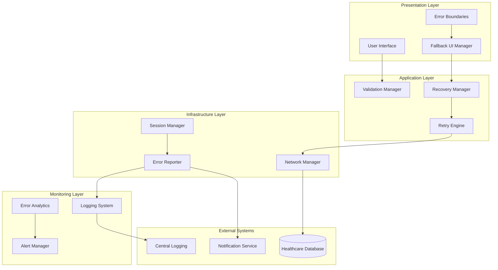

# Design Document: Error Handling and Recovery System

## Overview

The Error Handling and Recovery System provides comprehensive error management for a healthcare application that processes sensitive patient data, insurance claims, and provider information. This system ensures robust error detection, graceful degradation, automatic recovery, and comprehensive monitoring while maintaining HIPAA compliance and patient safety standards.

The system implements a multi-layered approach to error handling:
- **Presentation Layer**: Error boundaries and user-friendly error messaging
- **Application Layer**: Retry mechanisms and recovery management
- **Infrastructure Layer**: Network error handling and session management
- **Monitoring Layer**: Error analytics and reporting

Key design principles:
- **Patient Safety First**: Critical errors never compromise patient data access
- **Graceful Degradation**: System maintains core functionality during failures
- **Automatic Recovery**: Minimal user intervention required for transient issues
- **Comprehensive Monitoring**: Proactive error detection and analysis
- **HIPAA Compliance**: All error handling respects patient data privacy

## Architecture

The Error Handling and Recovery System follows a layered architecture with clear separation of concerns:



### Core Components

**Error Boundary Layer**
- Catches unhandled JavaScript errors
- Provides component-level error isolation
- Manages fallback UI rendering
- Preserves user session state

**Recovery Management Layer**
- Orchestrates automatic error recovery
- Manages retry logic for transient failures
- Handles session restoration
- Validates data integrity post-recovery

**Monitoring and Analytics Layer**
- Collects comprehensive error metrics
- Provides real-time alerting
- Generates analytical reports
- Tracks system health trends

## Components and Interfaces

### Error Boundary Component

```typescript
interface ErrorBoundaryProps {
  fallbackComponent: React.ComponentType<ErrorFallbackProps>;
  onError: (error: Error, errorInfo: ErrorInfo) => void;
  isolationLevel: 'component' | 'page' | 'application';
}

interface ErrorFallbackProps {
  error: Error;
  resetError: () => void;
  errorId: string;
}
```

**Responsibilities:**
- Catch and contain JavaScript errors within component trees
- Render appropriate fallback UI based on error severity
- Preserve user session data during error states
- Log errors with contextual information

**Key Methods:**
- `componentDidCatch()`: Captures errors and triggers recovery
- `getDerivedStateFromError()`: Updates state to show fallback UI
- `resetErrorBoundary()`: Clears error state and restores normal UI

### Recovery Manager

```typescript
interface RecoveryManager {
  recoverFromError(error: ErrorContext): Promise<RecoveryResult>;
  preserveUserState(state: UserState): void;
  restoreUserState(): Promise<UserState>;
  validateDataIntegrity(): Promise<ValidationResult>;
}

interface ErrorContext {
  errorType: ErrorType;
  severity: ErrorSeverity;
  component: string;
  userSession: SessionInfo;
  timestamp: Date;
}
```

**Responsibilities:**
- Coordinate automatic error recovery processes
- Manage user state preservation and restoration
- Validate system integrity after recovery
- Provide manual recovery options when automatic recovery fails

### Retry Engine

```typescript
interface RetryEngine {
  executeWithRetry<T>(
    operation: () => Promise<T>,
    config: RetryConfig
  ): Promise<T>;
  shouldRetry(error: Error): boolean;
  calculateBackoff(attempt: number): number;
}

interface RetryConfig {
  maxAttempts: number;
  baseDelay: number;
  maxDelay: number;
  retryableErrors: ErrorType[];
  timeoutMultiplier: number;
}
```

**Responsibilities:**
- Execute operations with configurable retry logic
- Implement exponential backoff for retry attempts
- Determine retry eligibility based on error type
- Prevent retries for data modification operations

### Error Reporter

```typescript
interface ErrorReporter {
  reportError(error: ErrorReport): Promise<void>;
  sanitizeErrorData(error: Error): SanitizedError;
  notifyCriticalError(error: CriticalError): Promise<void>;
  generateErrorId(): string;
}

interface ErrorReport {
  errorId: string;
  timestamp: Date;
  severity: ErrorSeverity;
  message: string;
  stackTrace: string;
  userContext: UserContext;
  systemContext: SystemContext;
}
```

**Responsibilities:**
- Log comprehensive error information
- Sanitize patient data from error reports
- Transmit errors to central logging system
- Trigger immediate notifications for critical errors

### Network Manager

```typescript
interface NetworkManager {
  executeRequest<T>(request: NetworkRequest): Promise<T>;
  handleOfflineMode(): void;
  queueOfflineActions(actions: Action[]): void;
  retryQueuedActions(): Promise<void>;
}

interface NetworkRequest {
  url: string;
  method: HttpMethod;
  timeout: number;
  retryable: boolean;
  priority: RequestPriority;
}
```

**Responsibilities:**
- Handle network connectivity issues
- Manage offline mode operations
- Queue actions during connectivity loss
- Retry failed requests when connectivity restored

### Session Manager

```typescript
interface SessionManager {
  monitorSessionExpiry(): void;
  showExpiryWarning(timeRemaining: number): void;
  extendSession(): Promise<void>;
  saveSessionData(data: SessionData): void;
  restoreSessionData(): Promise<SessionData>;
}

interface SessionData {
  userId: string;
  formData: Record<string, any>;
  navigationState: NavigationState;
  timestamp: Date;
}
```

**Responsibilities:**
- Monitor session expiration timing
- Provide session extension capabilities
- Save and restore user session data
- Handle session timeout gracefully

## Data Models

### Error Classification

```typescript
enum ErrorType {
  NETWORK_ERROR = 'network_error',
  VALIDATION_ERROR = 'validation_error',
  AUTHENTICATION_ERROR = 'authentication_error',
  AUTHORIZATION_ERROR = 'authorization_error',
  DATA_INTEGRITY_ERROR = 'data_integrity_error',
  COMPONENT_ERROR = 'component_error',
  SYSTEM_ERROR = 'system_error'
}

enum ErrorSeverity {
  LOW = 'low',
  MEDIUM = 'medium',
  HIGH = 'high',
  CRITICAL = 'critical'
}
```

### Recovery State

```typescript
interface RecoveryState {
  isRecovering: boolean;
  recoveryType: RecoveryType;
  preservedData: UserState;
  recoveryAttempts: number;
  lastRecoveryTime: Date;
}

enum RecoveryType {
  AUTOMATIC = 'automatic',
  MANUAL = 'manual',
  PARTIAL = 'partial',
  FAILED = 'failed'
}
```

### Analytics Data

```typescript
interface ErrorMetrics {
  errorCount: number;
  errorRate: number;
  recoverySuccessRate: number;
  averageRecoveryTime: number;
  criticalErrorCount: number;
  userImpactScore: number;
}

interface ErrorTrend {
  timeframe: TimeFrame;
  errorTypes: Record<ErrorType, number>;
  affectedUsers: number;
  systemAvailability: number;
}
```

## Correctness Properties

*A property is a characteristic or behavior that should hold true across all valid executions of a system-essentially, a formal statement about what the system should do. Properties serve as the bridge between human-readable specifications and machine-verifiable correctness guarantees.*

After analyzing the acceptance criteria, I identified several redundant properties that can be consolidated:

**Property Reflection:**
- Properties 1.1 and 1.4 both test error containment and can be combined into a comprehensive error isolation property
- Properties 2.1 and 2.5 both test message content and can be combined into a message sanitization property  
- Properties 3.1, 3.2, and 3.5 all test retry behavior and can be combined into a comprehensive retry property
- Properties 4.1, 4.4, and 4.5 all test error report content and can be combined into a comprehensive reporting property
- Properties 7.1, 7.2, and 7.5 all test offline mode behavior and can be combined into an offline mode property
- Properties 8.1, 8.2, and 8.4 all test validation feedback and can be combined into a validation display property

### Property 1: Error Boundary Isolation and Recovery

*For any* JavaScript error occurring in any component within the Healthcare System, the Error Boundary should catch the error, display fallback UI within 100ms, preserve session data, prevent error propagation to parent components, and log error details before UI changes.

**Validates: Requirements 1.1, 1.2, 1.3, 1.4, 1.5**

### Property 2: User-Friendly Error Messages with Data Protection

*For any* error occurrence, the system should display plain language messages without technical jargon, include specific next steps, use appropriate visual priority for critical errors, include unique reference numbers, and maintain HIPAA compliance by sanitizing patient data.

**Validates: Requirements 2.1, 2.2, 2.3, 2.4, 2.5**

### Property 3: Comprehensive Retry Behavior

*For any* transient error, the Retry Engine should attempt up to 3 retries with exponential backoff (2^attempt_number seconds starting at 1 second), escalate to manual handling after failure, never retry patient data modifications, and increase timeouts by 30 seconds per retry attempt.

**Validates: Requirements 3.1, 3.2, 3.3, 3.4, 3.5**

### Property 4: Complete Error Reporting

*For any* error occurrence, the Error Reporter should log comprehensive details (timestamp, user ID, session ID, stack trace, browser info, system environment), transmit reports within 5 seconds, immediately notify administrators for critical errors, and sanitize patient data before transmission.

**Validates: Requirements 4.1, 4.2, 4.3, 4.4, 4.5**

### Property 5: Automatic Recovery with Data Preservation

*For any* error recovery operation, the Recovery Manager should restore original UI when errors resolve, preserve user input data, restore application state after session timeouts, validate data integrity post-recovery, and provide manual options when automatic recovery fails.

**Validates: Requirements 5.1, 5.2, 5.3, 5.4, 5.5**

### Property 6: Comprehensive Error Analytics

*For any* error analytics operation, the system should collect frequency data by error type/user role/time period, generate daily reports, trigger alerts when error rates exceed 5% per hour, track resolution times and recovery rates, and provide 30-day trend analysis.

**Validates: Requirements 6.1, 6.2, 6.3, 6.4, 6.5**

### Property 7: Network Error and Offline Mode Handling

*For any* network connectivity issue, the system should display offline indicators when connectivity is lost, queue actions for later transmission, show connection errors for 30-second timeouts, automatically retry failed requests when connectivity returns, and prevent real-time validation operations while offline.

**Validates: Requirements 7.1, 7.2, 7.3, 7.4, 7.5**

### Property 8: Data Validation Error Feedback

*For any* data validation error, the system should highlight specific invalid fields, display error messages adjacent to fields within 200ms, prevent form submission with errors, show all validation errors simultaneously, and provide format examples for complex fields.

**Validates: Requirements 8.1, 8.2, 8.3, 8.4, 8.5**

### Property 9: Session Management with Data Preservation

*For any* session management operation, the system should display warnings 5 minutes before expiry, provide extension options in warnings, save draft data locally before session expiry redirects, offer restoration after login, and clear local data after restoration or dismissal.

**Validates: Requirements 9.1, 9.2, 9.3, 9.4, 9.5**

### Property 10: Critical Error Graceful Degradation

*For any* critical error occurrence, the system should maintain read-only patient data access, display emergency contact information when systems are unavailable, provide cached data access for 30 minutes during database failures, prevent data modifications during critical states, and automatically restore full functionality when errors resolve.

**Validates: Requirements 10.1, 10.2, 10.3, 10.4, 10.5**

## Error Handling

The Error Handling and Recovery System implements comprehensive error management strategies across multiple layers:

### Error Classification and Severity

**Error Types:**
- **Network Errors**: Connectivity issues, timeouts, service unavailability
- **Validation Errors**: Invalid user input, data format issues
- **Authentication/Authorization Errors**: Login failures, permission issues
- **Data Integrity Errors**: Corruption, inconsistency, constraint violations
- **Component Errors**: UI component failures, rendering issues
- **System Errors**: Database failures, service crashes, resource exhaustion

**Severity Levels:**
- **Critical**: Affects patient safety or data integrity
- **High**: Prevents core functionality
- **Medium**: Degrades user experience
- **Low**: Minor inconveniences

### Error Response Strategies

**Immediate Response (0-100ms):**
- Display appropriate fallback UI
- Preserve user session and input data
- Log error details with context
- Isolate error to prevent propagation

**Short-term Response (1-30 seconds):**
- Execute retry logic for transient errors
- Transmit error reports to monitoring systems
- Notify administrators for critical errors
- Provide user guidance and next steps

**Long-term Response (minutes to hours):**
- Analyze error patterns and trends
- Generate comprehensive reports
- Implement preventive measures
- Update system configurations

### Recovery Mechanisms

**Automatic Recovery:**
- Component-level error boundaries with fallback UI
- Exponential backoff retry for transient failures
- Session restoration after timeouts
- Network request queuing during connectivity issues

**Manual Recovery:**
- User-initiated retry options
- Manual session extension
- Draft data restoration prompts
- Emergency contact information display

**Graceful Degradation:**
- Read-only mode during critical errors
- Cached data access during database failures
- Offline mode with action queuing
- Essential functionality preservation

## Testing Strategy

The Error Handling and Recovery System requires comprehensive testing using both unit tests and property-based tests to ensure reliability and correctness.

### Property-Based Testing

Property-based testing will be implemented using **Hypothesis** (Python) or **fast-check** (JavaScript/TypeScript) to verify universal properties across all possible inputs and error conditions.

**Configuration:**
- Minimum 100 iterations per property test
- Each test tagged with: **Feature: error-handling-and-recovery, Property {number}: {property_text}**
- Comprehensive input generation including edge cases and error conditions

**Key Property Tests:**
- Error boundary isolation across all component hierarchies
- Retry behavior with various error types and network conditions
- Data sanitization across all error reporting scenarios
- Session management across all timeout and recovery scenarios
- Offline mode behavior across all connectivity patterns

### Unit Testing

Unit tests will focus on specific examples, integration points, and edge cases that complement property-based testing:

**Error Boundary Tests:**
- Specific error types (TypeError, ReferenceError, etc.)
- Component hierarchy edge cases
- Session data preservation scenarios
- Fallback UI rendering verification

**Recovery Manager Tests:**
- Integration with external services
- Data integrity validation scenarios
- Manual recovery option presentation
- State restoration edge cases

**Network Manager Tests:**
- Specific timeout scenarios
- Offline/online transition handling
- Action queue management
- Request priority handling

**Analytics Tests:**
- Report generation with specific data sets
- Alert threshold calculations
- Trend analysis accuracy
- Performance metric tracking

### Integration Testing

**End-to-End Error Scenarios:**
- Complete error-to-recovery workflows
- Cross-component error propagation
- Multi-layer error handling coordination
- Real-world failure simulation

**Performance Testing:**
- Error handling response times
- Recovery operation performance
- Analytics processing efficiency
- Memory usage during error states

**Security Testing:**
- Patient data sanitization verification
- Error message information leakage prevention
- Session security during error states
- Audit trail completeness

### Testing Environment Requirements

**Healthcare Data Simulation:**
- Synthetic patient data for testing
- HIPAA-compliant test environments
- Realistic data volume simulation
- Error injection capabilities

**Monitoring Integration:**
- Test environment analytics
- Error reporting verification
- Alert system testing
- Performance metric collection

The dual testing approach ensures both comprehensive coverage through property-based testing and specific scenario validation through unit tests, providing confidence in the system's reliability and correctness under all conditions.