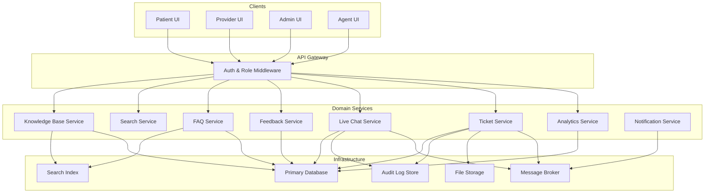
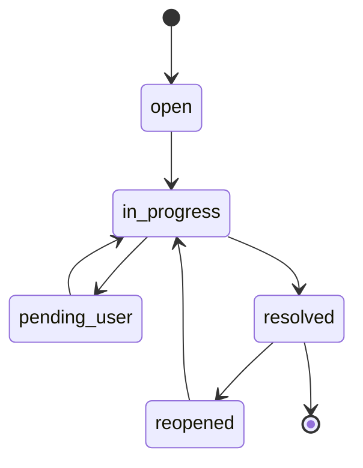

# Design Document: Help and Support System

## Overview

The Help and Support System is a HIPAA-compliant support platform integrated into a healthcare application serving patients, healthcare professionals, and administrators. It provides a searchable knowledge base, FAQ management, live chat with agents, support ticket tracking, user feedback collection, and analytics reporting.

The system must enforce role-based content visibility, prevent PHI exposure across all channels, maintain immutable audit logs, and meet strict SLA response targets. All interactions involving PHI-adjacent content are logged to a tamper-proof audit trail.

### Key Design Goals

- Role-aware content delivery with zero PHI leakage in search snippets, analytics, or chat
- Append-only audit logging satisfying HIPAA 6-year retention requirements
- Sub-second search response with relevance ranking
- Real-time chat with automatic session management and PHI detection
- SLA enforcement with automated escalation
- Content freshness tracking with stale-content notifications

---

## Architecture

The system follows a layered service architecture with clear separation between the API gateway, domain services, and persistence layer.



### Communication Patterns

- Synchronous REST for CRUD operations and queries
- WebSocket for live chat message delivery
- Event-driven (message broker) for analytics event ingestion, notifications, and SLA monitoring
- Append-only write path for the Audit Log — no update or delete operations permitted

---

## Components and Interfaces

### Knowledge Base Service

Manages article lifecycle: creation, versioning, publication, category hierarchy, and role-based visibility.

**Key operations:**
- `createArticle(payload, adminId) → Article`
- `updateArticle(articleId, patch, adminId) → Article` — saves previous version to history
- `setPublicationStatus(articleId, status, adminId) → Article`
- `deleteArticle(articleId, adminId) → void | Error` — blocked if referenced by open ticket
- `getArticle(articleId, userRole) → Article | AccessDenied`
- `markReviewed(articleId, adminId) → Article`
- `listStaleContent(thresholdDays: 90) → StaleContentReport`

### FAQ Service

Manages FAQ entries and categories with ordering and versioning.

**Key operations:**
- `createFAQ(payload, adminId) → FAQ`
- `updateFAQ(faqId, patch, adminId) → FAQ` — retains previous answer in history
- `reorderFAQ(categoryId, orderedIds, adminId) → void`
- `getFAQsByCategory(categoryId, userRole) → FAQ[]` — sorted by displayOrder ascending
- `publishFAQ(faqId, adminId) → FAQ | ValidationError`

### Search Service

Indexes published articles and FAQs; executes ranked, role-filtered queries.

**Key operations:**
- `index(contentId, contentType, fields) → void` — called on publish events
- `search(query, userRole) → SearchResult[]` — returns within 1 second, filters by role
- `getSnippet(contentId, query) → string` — PHI-scrubbed snippet

Relevance scoring weights: title match (3×), tag match (2×), body match (1×).

### Feedback Service

Collects ratings and comments; enforces one-per-user-per-content-per-24h.

**Key operations:**
- `submitFeedback(contentId, contentType, userId, rating, comment) → Feedback | RateLimitError`
- `getAverageRating(contentId) → number` — cached, refreshed within 5 minutes

### Live Chat Service

Manages chat sessions, agent queuing, PHI detection, and session transcripts.

**Key operations:**
- `initiateSession(userId, userRole) → ChatSession`
- `sendMessage(sessionId, senderId, text) → MessageAck` — triggers PHI scan and audit write
- `acceptSession(sessionId, agentId) → void`
- `closeSession(sessionId, reason) → Transcript`
- `convertToTicket(sessionId) → Ticket`
- `getQueuePosition(sessionId) → QueueStatus`

PHI detection uses pattern matching (SSN, MRN, DOB, insurance ID formats) before message delivery.

### Audit Log Service

Append-only event store. No update or delete endpoints exist.

**Key operations:**
- `append(event: AuditEvent) → AuditAck` — must confirm before message delivery
- `query(filters) → AuditEvent[]` — read-only, admin/compliance access only

### Ticket Service

Handles ticket creation, status transitions, SLA tracking, and file attachments.

**Key operations:**
- `createTicket(payload, userId) → Ticket`
- `transition(ticketId, newStatus, agentId) → Ticket | TransitionError`
- `assignAgent(ticketId, agentId) → Ticket`
- `attachFile(ticketId, file) → Attachment | ValidationError`
- `searchTickets(filters, requestingUser) → PaginatedTickets`
- `getSLAStatus(ticketId) → SLAStatus`

Valid status transitions enforced as a finite state machine:
`open → in_progress → pending_user ↔ in_progress → resolved → reopened → in_progress`

### Analytics Service

Ingests events from the message broker, aggregates metrics, and serves reports.

**Key operations:**
- `recordEvent(event: AnalyticsEvent) → void` — async, from broker
- `getReport(reportType, dateRange, adminId) → ReportData` — returns within 5 seconds for ≤90 days
- `getLowRatedContent(threshold: 2.5) → ContentFlag[]`
- `getReportJSON(reportType, dateRange) → JSON` — external API endpoint

### Notification Service

Sends notifications via registered channels (email, in-app) for ticket updates, SLA alerts, and weekly digests.

**Key operations:**
- `notifyTicketUpdate(ticketId, userId, transition) → void`
- `sendSLAEscalation(ticketId, supervisorId) → void`
- `sendWeeklyStaleDigest(adminIds, staleItems) → void`
- `sendSatisfactionPrompt(ticketId, userId) → void`

---

## Data Models

### Article

```typescript
interface Article {
  id: string;                        // UUID, system-assigned
  title: string;
  body: string;
  category: CategoryPath;            // max 3 levels deep
  tags: string[];
  authorId: string;
  permittedRoles: Role[];            // Patient | Provider | Admin
  containsPHI: boolean;
  publicationStatus: 'draft' | 'published';
  createdAt: Date;
  updatedAt: Date;
  lastReviewedAt: Date | null;
  isStale: boolean;                  // computed: lastReviewedAt < now - 90 days
  versionHistory: ArticleVersion[];
}

interface ArticleVersion {
  versionNumber: number;
  body: string;
  updatedAt: Date;
  updatedBy: string;
}

type CategoryPath = [string] | [string, string] | [string, string, string];
```

### FAQ

```typescript
interface FAQ {
  id: string;
  question: string;
  answer: string;
  categoryId: string;
  displayOrder: number;
  publicationStatus: 'draft' | 'published';
  createdAt: Date;
  updatedAt: Date;
  lastReviewedAt: Date | null;
  isStale: boolean;
  answerHistory: FAQVersion[];
}

interface FAQVersion {
  versionNumber: number;
  answer: string;
  updatedAt: Date;
  updatedBy: string;
}
```

### Feedback

```typescript
interface Feedback {
  id: string;
  contentId: string;
  contentType: 'article' | 'faq';
  userId: string;                    // internal only, never exposed in reports
  userRole: Role;
  rating: 1 | 2 | 3 | 4 | 5;
  comment: string | null;
  submittedAt: Date;
}
```

### ChatSession

```typescript
interface ChatSession {
  id: string;
  userId: string;
  userRole: Role;
  agentId: string | null;
  status: 'queued' | 'active' | 'closed';
  startedAt: Date;
  agentAssignedAt: Date | null;
  closedAt: Date | null;
  closeReason: 'resolved' | 'timeout' | 'converted_to_ticket' | null;
  messages: ChatMessage[];
}

interface ChatMessage {
  id: string;
  sessionId: string;
  senderRole: 'user' | 'agent';
  senderId: string;
  text: string;
  sentAt: Date;
  contentHash: string;               // SHA-256 of message text, stored in audit log
  phiDetected: boolean;
}
```

### AuditEvent

```typescript
interface AuditEvent {
  id: string;
  eventType: AuditEventType;
  sessionId: string | null;
  ticketId: string | null;
  actorId: string;
  actorRole: Role;
  contentHash: string | null;
  occurredAt: Date;
  metadata: Record<string, unknown>;
}

type AuditEventType =
  | 'message_sent'
  | 'session_opened'
  | 'session_closed'
  | 'article_accessed_phi'
  | 'ticket_phi_warning'
  | 'ticket_created'
  | 'ticket_transitioned';
```

### SupportTicket

```typescript
interface SupportTicket {
  id: string;
  submittedBy: string;
  subject: string;                   // 1–200 chars
  description: string;               // 1–2000 chars
  category: string;
  priority: 'low' | 'medium' | 'high' | 'critical';
  status: TicketStatus;
  assignedAgentId: string | null;
  attachments: Attachment[];
  slaDeadline: Date;
  createdAt: Date;
  updatedAt: Date;
  statusHistory: StatusTransition[];
  satisfactionRating: 1 | 2 | 3 | 4 | 5 | null;
}

type TicketStatus = 'open' | 'in_progress' | 'pending_user' | 'resolved' | 'reopened';

interface StatusTransition {
  from: TicketStatus;
  to: TicketStatus;
  changedBy: string;
  changedAt: Date;
}

interface Attachment {
  id: string;
  filename: string;
  mimeType: 'application/pdf' | 'image/png' | 'image/jpeg' | 'application/vnd.openxmlformats-officedocument.wordprocessingml.document';
  sizeBytes: number;                 // max 10 MB
  storageKey: string;
}
```

### AnalyticsEvent

```typescript
interface AnalyticsEvent {
  id: string;
  eventType: 'article_view' | 'faq_view' | 'search_query' | 'chat_initiated'
           | 'chat_resolved' | 'ticket_created' | 'ticket_resolved' | 'feedback_submitted';
  contentId: string | null;
  userRole: Role;                    // no userId — privacy-preserving
  occurredAt: Date;
  metadata: Record<string, unknown>; // e.g., search term (no PHI), resolution time
}
```

### Ticket Status FSM




---

## Correctness Properties

*A property is a characteristic or behavior that should hold true across all valid executions of a system — essentially, a formal statement about what the system should do. Properties serve as the bridge between human-readable specifications and machine-verifiable correctness guarantees.*

### Property 1: Content Required Fields Invariant

*For any* Article or FAQ entry created through the system, the resulting record shall contain all required fields (id, title/question, body/answer, category, author/creator, createdAt, updatedAt, publicationStatus) with non-null values.

**Validates: Requirements 1.1, 4.1**

---

### Property 2: Unique Identifier Assignment

*For any* collection of Articles, FAQ entries, Chat Sessions, or Support Tickets created by the system, no two records of the same type shall share the same identifier.

**Validates: Requirements 1.2, 4.2, 6.1, 8.1**

---

### Property 3: Version History Preservation on Update

*For any* Article or FAQ entry, after an update operation, the previous version of the body/answer shall appear in the record's version history, and the updatedAt timestamp shall be strictly greater than the previous updatedAt value.

**Validates: Requirements 1.3, 4.3**

---

### Property 4: Publication Status Controls Visibility

*For any* Article or FAQ entry, if its publicationStatus is "published", users with a permitted role shall be able to retrieve it; if its publicationStatus is "draft", only Admin users shall be able to retrieve it, and all other roles shall receive an access-denied response.

**Validates: Requirements 1.4, 1.5**

---

### Property 5: Category Depth Constraint

*For any* Article, a category path with 1, 2, or 3 levels shall be accepted; a category path with 4 or more levels shall be rejected with a validation error.

**Validates: Requirements 1.6**

---

### Property 6: Referential Integrity on Article Deletion

*For any* Article that is referenced by at least one open Support Ticket, a deletion attempt shall be rejected and the error response shall identify the referencing ticket identifiers.

**Validates: Requirements 1.7**

---

### Property 7: Role-Based Access Denial Without Information Leakage

*For any* Article and any User whose role is not in the Article's permittedRoles list, the response to a retrieval request shall be identical regardless of whether the Article exists — no content, title, or existence information shall be revealed.

**Validates: Requirements 2.3**

---

### Property 8: PHI Article Access Audit Logging

*For any* Article flagged as containsPHI, after an authenticated user successfully accesses it, an audit log entry shall exist recording the access event with the user's role and a timestamp.

**Validates: Requirements 2.4**

---

### Property 9: Search Results Role Filtering

*For any* search query submitted by a user with role R, every result returned shall be content whose permittedRoles includes R; no content restricted to other roles shall appear in the results.

**Validates: Requirements 3.4**

---

### Property 10: Search Result Relevance Ordering

*For any* search query that returns multiple results, the results shall be ordered in non-increasing relevance score, where relevance is computed as (3 × title match) + (2 × tag match) + (1 × body match).

**Validates: Requirements 3.2, 3.3**

---

### Property 11: Partial-Word Search Matching

*For any* published content containing a word W of length ≥ 3, a search query that is a prefix of W with length ≥ 3 shall include that content in its results.

**Validates: Requirements 3.6**

---

### Property 12: Search Snippets Contain No PHI

*For any* search result snippet generated by the system, the snippet text shall not contain patterns matching known PHI formats (SSN, MRN, DOB, insurance ID).

**Validates: Requirements 3.7**

---

### Property 13: FAQ Empty Answer Rejection

*For any* FAQ entry whose answer field is empty or composed entirely of whitespace, a publish operation shall be rejected with a validation error.

**Validates: Requirements 4.6**

---

### Property 14: FAQ Category Sort Order

*For any* FAQ category, the list of FAQ entries returned shall be sorted in non-decreasing order of their displayOrder integer values.

**Validates: Requirements 4.5**

---

### Property 15: Feedback Rate Limiting

*For any* user U and content item C, if U has submitted feedback on C within the past 24 hours, a second submission attempt shall be rejected with an error message indicating when the next submission is permitted.

**Validates: Requirements 5.2, 5.3**

---

### Property 16: Average Rating Computation Correctness

*For any* content item with a set of feedback ratings R₁, R₂, …, Rₙ, the average rating exposed by the Analytics Engine shall equal (R₁ + R₂ + … + Rₙ) / n, rounded to two decimal places.

**Validates: Requirements 5.4**

---

### Property 17: Analytics Reports Contain No User-Identifying Information

*For any* analytics report or aggregated feedback output, the response shall contain no userId fields, no PHI patterns, and no data that could identify an individual user.

**Validates: Requirements 5.5, 11.5**

---

### Property 18: Agent Assignment Timestamp Recording

*For any* Chat Session, when an agent accepts the session, the agentAssignedAt timestamp shall be set to a non-null value and the session status shall transition from "queued" to "active".

**Validates: Requirements 6.3**

---

### Property 19: Session Timeout Closes Session

*For any* Chat Session whose last message timestamp is older than the configured Session_Timeout duration, the session status shall be "closed" and both the user and agent shall have received a closure notification.

**Validates: Requirements 6.5**

---

### Property 20: Closed Session Audit Log Completeness

*For any* closed Chat Session, the Audit Log shall contain an entry with the session identifier, user role, agent identifier, start timestamp, and end timestamp.

**Validates: Requirements 6.6**

---

### Property 21: PHI Detection in User-Submitted Content

*For any* chat message or ticket description submitted by a user that contains text matching PHI patterns (SSN, MRN, DOB, insurance ID formats), the system shall flag the content, display a warning to the user, and write an audit log entry recording the detection event.

**Validates: Requirements 6.7, 8.5**

---

### Property 22: Every Message Has an Audit Log Entry

*For any* message sent in a Chat Session, an Audit Log entry shall exist containing the session identifier, sender role, message timestamp, and a SHA-256 hash of the message content.

**Validates: Requirements 7.1, 7.2**

---

### Property 23: Audit Log Immutability

*For any* existing Audit Log entry, any attempt to modify or delete that entry shall be rejected; the Audit Log shall only accept append operations.

**Validates: Requirements 7.3**

---

### Property 24: New Ticket Initial State

*For any* successfully submitted Support Ticket, the initial status shall be "open", the createdAt timestamp shall be set, and a unique identifier shall be returned.

**Validates: Requirements 8.1**

---

### Property 25: Ticket Field Validation

*For any* ticket submission where the subject is empty, exceeds 200 characters, the description is empty, exceeds 2000 characters, or the category is missing, the submission shall be rejected with a descriptive validation error.

**Validates: Requirements 8.2**

---

### Property 26: Priority-to-SLA Deadline Mapping

*For any* Support Ticket, the slaDeadline shall equal createdAt plus the priority-specific duration: critical = 1 hour, high = 4 hours, medium = 24 hours, low = 72 hours.

**Validates: Requirements 8.3, 9.4**

---

### Property 27: Attachment Validation

*For any* file attachment submitted to a ticket, the system shall reject: files exceeding 10 MB, files with MIME types other than PDF/PNG/JPG/DOCX, and any attachment when the ticket already has 3 attachments.

**Validates: Requirements 8.6**

---

### Property 28: Ticket Status FSM Enforcement

*For any* ticket status transition, only the transitions (open→in_progress, in_progress→pending_user, pending_user→in_progress, in_progress→resolved, resolved→reopened, reopened→in_progress) shall succeed; all other transitions shall be rejected with an error identifying the invalid transition.

**Validates: Requirements 9.1, 9.2**

---

### Property 29: Status Transition Audit Trail

*For any* ticket status change, a StatusTransition record shall be appended to the ticket's statusHistory containing the from-status, to-status, changedBy, and changedAt fields.

**Validates: Requirements 9.3**

---

### Property 30: SLA Escalation Trigger

*For any* unresolved ticket where the current time is within 30 minutes of the slaDeadline, an escalation alert event shall be emitted targeting the assigned agent's supervisor.

**Validates: Requirements 9.5**

---

### Property 31: Satisfaction Prompt on Resolution

*For any* ticket that transitions to "resolved" status, a satisfaction rating prompt event shall be emitted for the submitting user within the 48-hour window.

**Validates: Requirements 9.6**

---

### Property 32: Ticket Filter Correctness

*For any* filter query specifying one or more of (status, priority, category, assignedAgent, dateRange), every ticket in the result set shall satisfy all specified filter criteria; no ticket failing any criterion shall appear in results.

**Validates: Requirements 10.1**

---

### Property 33: Ticket Full-Text Search Recall

*For any* ticket whose subject or description contains a search term T, a full-text search for T shall include that ticket in its results.

**Validates: Requirements 10.3**

---

### Property 34: User Ticket Isolation

*For any* user U performing a self-search, every ticket in the result set shall have submittedBy equal to U's identifier; no ticket submitted by another user shall appear.

**Validates: Requirements 10.4**

---

### Property 35: Pagination Page Size Invariant

*For any* paginated ticket search with configured page size P (where 10 ≤ P ≤ 100), every page except the last shall contain exactly P records, and the last page shall contain between 1 and P records.

**Validates: Requirements 10.5**

---

### Property 36: Analytics Event Collection Completeness

*For any* action of type (article view, FAQ view, search query, chat initiated, chat resolved, ticket created, ticket resolved, feedback submitted), an AnalyticsEvent of the corresponding type shall be recorded in the Analytics Engine.

**Validates: Requirements 11.1**

---

### Property 37: Low-Rating Content Flagging

*For any* Article or FAQ entry whose computed average feedback rating is strictly less than 2.5, it shall appear in the low-rated content list returned by the Analytics Engine.

**Validates: Requirements 11.6**

---

### Property 38: Analytics API Returns Valid JSON

*For any* report requested via the Analytics API endpoint, the response body shall be valid, parseable JSON conforming to the report schema.

**Validates: Requirements 11.7**

---

### Property 39: Independent Timestamp Tracking and Staleness

*For any* Article or FAQ entry, the lastReviewedAt and updatedAt timestamps shall be independently updatable — updating one shall not affect the other. Furthermore, for any content where (now − lastReviewedAt) ≥ 90 days, isStale shall be true; for content reviewed within 90 days, isStale shall be false.

**Validates: Requirements 12.1, 12.2, 12.3**

---

### Property 40: Stale Content Digest Completeness

*For any* stale Article or FAQ entry (isStale = true), it shall appear in the weekly digest sent to admins, including its lastReviewedAt date and authorId.

**Validates: Requirements 12.4**

---

### Property 41: Stale Content User Notice

*For any* stale Article accessed by a non-admin user, the response shall include an "under review" notice without revealing the staleness details or the lastReviewedAt timestamp.

**Validates: Requirements 12.5**

---

## Error Handling

### Validation Errors

All validation failures return a structured error response:

```json
{
  "error": "VALIDATION_ERROR",
  "message": "Human-readable description",
  "field": "fieldName",
  "code": "SPECIFIC_ERROR_CODE"
}
```

Error codes include: `EMPTY_FIELD`, `FIELD_TOO_LONG`, `INVALID_STATUS_TRANSITION`, `DUPLICATE_FEEDBACK`, `ATTACHMENT_LIMIT_EXCEEDED`, `INVALID_FILE_TYPE`, `FILE_TOO_LARGE`, `CATEGORY_DEPTH_EXCEEDED`, `ARTICLE_REFERENCED_BY_TICKET`.

### Access Control Errors

Unauthorized access returns HTTP 403 with a generic message. For role-restricted articles, the response is identical whether the article exists or not (no existence leakage):

```json
{ "error": "ACCESS_DENIED", "message": "You do not have permission to access this resource." }
```

### PHI Detection Warnings

PHI detection in chat or ticket descriptions does not block submission but returns a warning alongside the normal response:

```json
{
  "warning": "PHI_DETECTED",
  "message": "Your submission may contain protected health information. Please remove PHI before submitting.",
  "auditLogId": "uuid"
}
```

### Audit Log Write Failures

If the Audit Log write fails, the Live Chat service shall not deliver the message to the recipient. The failure is surfaced to the sender as a transient error with retry guidance. This ensures the audit-before-delivery guarantee (Requirement 7.4).

### SLA Monitoring Failures

If the SLA escalation notification fails to deliver, the system shall retry up to 3 times with exponential backoff and log the failure. Undelivered escalations are surfaced in the Admin dashboard.

### Search Index Lag

If a newly published article is not yet indexed, search queries may temporarily miss it. The system does not surface this as an error; the 60-second indexing SLA (Requirement 3.1) is monitored via the Analytics Engine.

---

## Testing Strategy

### Dual Testing Approach

Both unit tests and property-based tests are required. They are complementary:

- Unit tests verify specific examples, integration points, and edge cases
- Property-based tests verify universal correctness across randomized inputs

### Unit Testing

Unit tests cover:

- Specific valid and invalid ticket field combinations (boundary values: subject = 1, 200, 201 chars)
- Known PHI pattern strings (SSN format `XXX-XX-XXXX`, MRN format) triggering detection
- Exact FSM transition table — all 6 valid transitions and a representative set of invalid ones
- Zero-results search returning ticket prompt
- Chat session conversion to ticket pre-populating correct fields
- Weekly stale digest email content for a known set of stale articles
- Audit log append confirmation before message delivery (integration test)

### Property-Based Testing

The property-based testing library shall be selected based on the implementation language (e.g., `fast-check` for TypeScript/JavaScript, `Hypothesis` for Python, `QuickCheck` for Haskell/Scala).

Each property test shall run a minimum of 100 iterations. Each test must include a comment referencing the design property it validates.

Tag format: `Feature: help-and-support-system, Property {N}: {property_title}`

**Property test mapping:**

| Property | Test Description | Generator Inputs |
|---|---|---|
| P1 | Content required fields | Random article/FAQ payloads |
| P2 | Unique ID assignment | Batch creation of N articles/FAQs/sessions/tickets |
| P3 | Version history on update | Random article + random patch |
| P4 | Publication status visibility | Random article, random role |
| P5 | Category depth constraint | Random category paths of length 1–5 |
| P6 | Referential integrity on delete | Random article + open ticket referencing it |
| P7 | Access denial without leakage | Random article, random unauthorized role |
| P8 | PHI article audit logging | Random PHI-flagged article + random authenticated user |
| P9 | Search role filtering | Random content set with mixed roles, random query |
| P10 | Search relevance ordering | Random content set, random query |
| P11 | Partial-word matching | Random words, prefix queries |
| P12 | Snippets contain no PHI | Random content with embedded PHI patterns |
| P13 | FAQ empty answer rejection | Random whitespace/empty strings as answer |
| P14 | FAQ category sort order | Random FAQ set with random displayOrder values |
| P15 | Feedback rate limiting | Random user + content, two submissions within 24h |
| P16 | Average rating computation | Random rating arrays |
| P17 | Analytics privacy | Random event sets, report generation |
| P18 | Agent assignment timestamp | Random session + agent acceptance |
| P19 | Session timeout closure | Random session with configurable timeout |
| P20 | Closed session audit completeness | Random session lifecycle |
| P21 | PHI detection in submissions | Random strings with/without PHI patterns |
| P22 | Every message has audit entry | Random chat session with N messages |
| P23 | Audit log immutability | Random existing entries + modify/delete attempts |
| P24 | New ticket initial state | Random valid ticket payloads |
| P25 | Ticket field validation | Random strings at boundary lengths |
| P26 | Priority-to-SLA mapping | Random priority values |
| P27 | Attachment validation | Random file sizes, types, counts |
| P28 | Ticket FSM enforcement | All valid + random invalid transitions |
| P29 | Status transition audit trail | Random ticket + sequence of valid transitions |
| P30 | SLA escalation trigger | Random tickets with varying time-to-deadline |
| P31 | Satisfaction prompt on resolution | Random ticket resolved transitions |
| P32 | Ticket filter correctness | Random ticket sets + random filter combinations |
| P33 | Full-text search recall | Random tickets with known terms |
| P34 | User ticket isolation | Random multi-user ticket sets |
| P35 | Pagination page size invariant | Random result sets, random page sizes 10–100 |
| P36 | Analytics event completeness | Each action type triggered once |
| P37 | Low-rating content flagging | Random feedback sets with average < and ≥ 2.5 |
| P38 | Analytics API JSON validity | Random report requests |
| P39 | Independent timestamps + staleness | Random lastReviewedAt values relative to now |
| P40 | Stale digest completeness | Random stale content sets |
| P41 | Stale content user notice | Random stale articles + non-admin user access |

### Integration Testing

Integration tests cover end-to-end flows:

- Full ticket lifecycle: create → assign → in_progress → resolved → satisfaction prompt
- Chat session: initiate → queue → agent accept → messages → close → audit log verification
- Search indexing: publish article → wait for index → search → verify result appears
- PHI flow: submit ticket with PHI → verify warning + audit log entry
- SLA escalation: create critical ticket → advance clock past deadline - 30 min → verify escalation event

### HIPAA Compliance Testing

- Verify audit log entries exist for all PHI-adjacent access events
- Verify no PHI appears in search snippets, analytics reports, or feedback aggregates
- Verify audit log rejects all modification and deletion attempts
- Verify 6-year retention policy is configured in the storage layer
