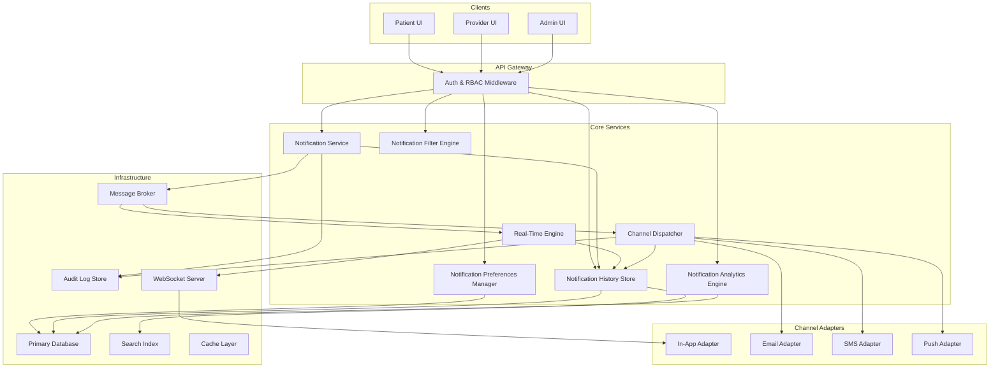
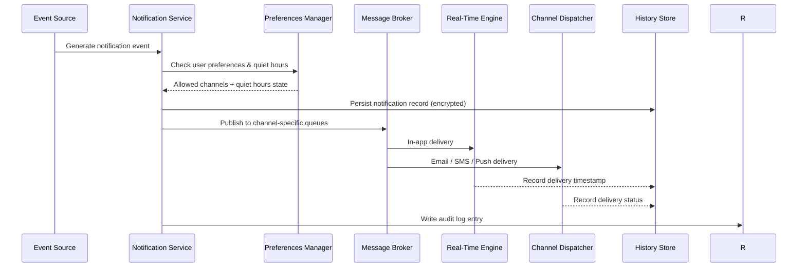

# Design Document: Notification Management Interface

## Overview

The Notification Management Interface is a HIPAA-compliant notification system for a healthcare platform serving patients, healthcare professionals, and administrators. It delivers real-time and asynchronous notifications across four channels (in-app, email, SMS, push), enforces granular per-user preferences, maintains a searchable and auditable notification history, and provides operational analytics for administrators.

All notification content involving Protected Health Information (PHI) is encrypted at rest (AES-256) and in transit (TLS 1.2+). PHI is never included in SMS or push payloads. Every PHI-touching action is recorded in an immutable audit log. The system is designed to support 10,000+ concurrent WebSocket connections with sub-3-second in-app delivery latency.

### Key Design Goals

- Granular per-user, per-type, per-channel preference enforcement with quiet hours support
- Real-time in-app delivery via WebSocket with reconnection and catch-up semantics
- Multi-channel dispatch (in-app, email, SMS, push) with retry and fallback logic
- HIPAA compliance: AES-256 at rest, TLS 1.2+ in transit, immutable audit log, 6-year retention
- Searchable, paginated notification history with real-time unread count
- Visual and semantic distinction across notification types and priority levels
- Aggregated, de-identified analytics with automated failure alerting
- Admin controls for templates, mandatory types, rate limits, and A/B testing

---

## Architecture

The system follows a layered service architecture with an event-driven dispatch pipeline. Notifications flow from generation through preference enforcement, channel dispatch, and delivery recording.



### Notification Lifecycle



---

## Components and Interfaces

### Notification Service

Central orchestrator. Receives notification generation events, enforces preferences, persists records, publishes to the message broker, and writes audit log entries.

```typescript
interface NotificationService {
  generate(event: NotificationEvent): Promise<NotificationRecord>;
  markDelivered(notificationId: string, channel: DeliveryChannel, timestamp: Date): Promise<void>;
  markUndeliverable(notificationId: string, channel: DeliveryChannel, reason: string): Promise<void>;
}

interface NotificationEvent {
  userId: string;
  type: NotificationType;
  priority: PriorityLevel;
  subject: string;
  summary: string;       // non-PHI summary safe for SMS/push
  fullContent: string;   // may contain PHI, encrypted at rest
  metadata: Record<string, string>;
  sourceSystem: string;
}
```

### Notification Preferences Manager

Stores and enforces per-user preferences. Provides role-based defaults and supports quiet hours configuration.

```typescript
interface NotificationPreferencesManager {
  getPreferences(userId: string): Promise<UserPreferences>;
  updatePreference(userId: string, update: PreferenceUpdate): Promise<void>;
  setQuietHours(userId: string, config: QuietHoursConfig): Promise<void>;
  isChannelEnabled(userId: string, type: NotificationType, channel: DeliveryChannel): Promise<boolean>;
  isMandatory(type: NotificationType): Promise<boolean>;
  createDefaultPreferences(userId: string, role: UserRole): Promise<void>;
}

interface UserPreferences {
  userId: string;
  preferences: ChannelPreference[];
  quietHours: QuietHoursConfig | null;
  updatedAt: Date;
}

interface ChannelPreference {
  notificationType: NotificationType;
  channel: DeliveryChannel;
  enabled: boolean;
}

interface QuietHoursConfig {
  startTime: string;  // HH:MM in user's timezone
  endTime: string;
  timezone: string;
  suppressCritical: boolean;  // always false per requirements
}
```

### Real-Time Engine

Manages WebSocket connections and delivers in-app notifications with catch-up semantics on reconnect.

```typescript
interface RealTimeEngine {
  connect(userId: string, sessionId: string): Promise<WebSocketConnection>;
  disconnect(userId: string, sessionId: string): Promise<void>;
  deliver(userId: string, notification: NotificationRecord): Promise<void>;
  deliverMissed(userId: string, since: Date): Promise<void>;
  getActiveConnectionCount(): Promise<number>;
}
```

### Channel Dispatcher

Routes notifications to external delivery channels with retry logic and PHI-safe payload construction.

```typescript
interface ChannelDispatcher {
  dispatch(notification: NotificationRecord, channel: DeliveryChannel): Promise<DispatchResult>;
  buildPayload(notification: NotificationRecord, channel: DeliveryChannel): ChannelPayload;
}

interface DispatchResult {
  notificationId: string;
  channel: DeliveryChannel;
  status: 'delivered' | 'failed' | 'undeliverable';
  attempts: number;
  deliveredAt?: Date;
  failureReason?: string;
}

// SMS and push payloads contain only non-PHI summary + secure deep link
interface ChannelPayload {
  channel: DeliveryChannel;
  recipient: string;
  subject?: string;
  body: string;
  deepLink?: string;
  containsPHI: boolean;  // always false for SMS and push
}
```

### Notification History Store

Persists all notification records with read/unread state, soft-delete for user-facing removal, and real-time unread counts.

```typescript
interface NotificationHistoryStore {
  save(notification: NotificationRecord): Promise<void>;
  getPage(userId: string, options: PaginationOptions): Promise<PaginatedResult<NotificationRecord>>;
  markRead(userId: string, notificationId: string): Promise<void>;
  softDelete(userId: string, notificationId: string): Promise<void>;
  getUnreadCount(userId: string): Promise<number>;
  search(userId: string, query: FilterQuery): Promise<PaginatedResult<NotificationRecord>>;
}

interface PaginationOptions {
  page: number;
  pageSize: number;  // default 25, max 100
  sortBy: 'timestamp';
  sortOrder: 'desc';
}
```

### Notification Filter Engine

Applies multi-dimensional AND-logic filters against notification history with session-persistent state.

```typescript
interface NotificationFilterEngine {
  applyFilters(userId: string, filters: FilterCriteria): Promise<PaginatedResult<NotificationRecord>>;
  saveFilterState(sessionId: string, filters: FilterCriteria): Promise<void>;
  getFilterState(sessionId: string): Promise<FilterCriteria | null>;
}

interface FilterCriteria {
  types?: NotificationType[];
  channels?: DeliveryChannel[];
  dateRange?: { start: Date; end: Date };
  readStatus?: 'read' | 'unread' | 'all';
  priority?: PriorityLevel[];
  freeText?: string;  // searches subject and non-PHI summary only
}
```

### Notification Analytics Engine

Aggregates delivery and engagement metrics. All output is de-identified; no PHI is exposed.

```typescript
interface NotificationAnalyticsEngine {
  getDeliveryMetrics(query: AnalyticsQuery): Promise<DeliveryMetrics>;
  getEngagementMetrics(query: AnalyticsQuery): Promise<EngagementMetrics>;
  checkFailureThresholds(): Promise<AlertEvent[]>;
  generateDailySummary(): Promise<DailySummaryReport>;
}

interface AnalyticsQuery {
  dateRange: { start: Date; end: Date };
  granularity: 'hourly' | 'daily' | 'weekly' | 'monthly';
  notificationType?: NotificationType;
  channel?: DeliveryChannel;
}

interface DeliveryMetrics {
  totalSent: number;
  totalDelivered: number;
  totalFailed: number;
  successRate: number;
  avgDeliveryLatencyMs: number;
}

interface EngagementMetrics {
  openRate: number;
  clickThroughRate: number;
  optOutRate: number;
}
```

---

## Data Models

### NotificationRecord

```typescript
interface NotificationRecord {
  id: string;                          // UUID
  userId: string;
  type: NotificationType;
  priority: PriorityLevel;
  subject: string;
  summary: string;                     // non-PHI, safe for SMS/push
  encryptedContent: string;            // AES-256 encrypted, may contain PHI
  channels: ChannelDeliveryRecord[];
  readAt: Date | null;
  deletedAt: Date | null;              // soft delete; record retained for HIPAA
  createdAt: Date;
  retainUntil: Date;                   // createdAt + 6 years for PHI records
  templateId: string | null;
  abVariant: 'A' | 'B' | null;
}

interface ChannelDeliveryRecord {
  channel: DeliveryChannel;
  status: 'pending' | 'delivered' | 'failed' | 'undeliverable' | 'queued';
  attempts: number;
  deliveredAt: Date | null;
  failureReason: string | null;
}
```

### Enumerations

```typescript
type NotificationType =
  | 'appointment'
  | 'lab_result'
  | 'prescription'
  | 'claim_status'
  | 'care_plan_update'
  | 'system_alert'
  | 'administrative_message';

type DeliveryChannel = 'in_app' | 'email' | 'sms' | 'push';

type PriorityLevel = 'critical' | 'high' | 'medium' | 'low';

type UserRole = 'patient' | 'healthcare_professional' | 'administrator';
```

### AuditLogEntry

```typescript
interface AuditLogEntry {
  id: string;
  userId: string;
  actorId: string;           // who performed the action
  action: AuditAction;
  notificationId: string;
  timestamp: Date;
  ipAddress: string;
  sessionId: string;
}

type AuditAction = 'created' | 'accessed' | 'modified' | 'deleted' | 'delivered' | 'failed';
```

### NotificationTemplate

```typescript
interface NotificationTemplate {
  id: string;
  notificationType: NotificationType;
  channel: DeliveryChannel;
  subjectTemplate: string;
  bodyTemplate: string;
  isActive: boolean;
  isMandatory: boolean;
  createdAt: Date;
  updatedAt: Date;
  abVariant: 'A' | 'B' | null;
  abTrafficPercent: number | null;  // 0-100, null if not A/B testing
}
```

### Default Preferences by Role

| Notification Type | Patient | Healthcare Professional | Administrator |
|---|---|---|---|
| appointment | in-app, email | in-app, email | in-app |
| lab_result | in-app, email | in-app, email, push | in-app |
| prescription | in-app, email | in-app | in-app |
| claim_status | in-app, email | — | in-app |
| care_plan_update | in-app | in-app, email | in-app |
| system_alert | in-app (mandatory) | in-app (mandatory) | in-app, email (mandatory) |
| administrative_message | in-app | in-app | in-app, email |

---


## Correctness Properties

*A property is a characteristic or behavior that should hold true across all valid executions of a system — essentially, a formal statement about what the system should do. Properties serve as the bridge between human-readable specifications and machine-verifiable correctness guarantees.*

### Property 1: Preference Enforcement — Disabled Channel Suppresses Dispatch

*For any* user, notification type, and delivery channel where the user has disabled that channel for that type, the notification service should not dispatch any notification of that type to that channel.

**Validates: Requirements 1.5**

---

### Property 2: Preference Persistence Round-Trip

*For any* user and any valid preference update (type + channel + enabled/disabled), reading back the preferences after the update should reflect the new value.

**Validates: Requirements 1.1, 1.3**

---

### Property 3: Role Default Preferences Created on Account Creation

*For any* user role (patient, healthcare professional, administrator), creating a new user account should result in a non-empty set of default preferences that matches the defined defaults for that role.

**Validates: Requirements 1.4**

---

### Property 4: Mandatory Notification Type Cannot Be Disabled

*For any* notification type designated as mandatory by an administrator, any attempt by any user to disable that type should be rejected and the preference should remain enabled.

**Validates: Requirements 1.6, 9.3**

---

### Property 5: Quiet Hours Queuing

*For any* user with active quiet hours and any non-critical notification generated during the quiet hours window, the notification's channel delivery status should be 'queued' rather than dispatched until the quiet hours window ends.

**Validates: Requirements 1.7, 1.8**

---

### Property 6: Reconnect Catch-Up Completeness

*For any* user who was disconnected for a period during which N notifications were generated, upon reconnection the real-time engine should deliver exactly those N undelivered notifications.

**Validates: Requirements 2.4**

---

### Property 7: In-App Delivery Recorded in History

*For any* notification delivered to a user's in-app session, the notification history store should contain a channel delivery record for the in-app channel with a non-null delivery timestamp and status 'delivered'.

**Validates: Requirements 2.6**

---

### Property 8: Retry Exhaustion Produces Undeliverable Status

*For any* notification where all delivery attempts to a channel fail, after exactly 3 retry attempts the channel delivery record should have status 'undeliverable' and attempt count equal to 3.

**Validates: Requirements 3.5**

---

### Property 9: Delivery Failure Logged in Audit Log

*For any* notification marked as undeliverable on any channel, an audit log entry with action 'failed' should exist for that notification ID.

**Validates: Requirements 3.6**

---

### Property 10: PHI Excluded from SMS and Push Payloads

*For any* notification dispatched to the SMS or push channel, the payload body should contain only the non-PHI summary and a secure deep link — the encrypted PHI content field should never appear in the payload.

**Validates: Requirements 3.7, 3.8**

---

### Property 11: PHI Encryption Round-Trip

*For any* notification record containing PHI, encrypting the content and then decrypting it should produce the original plaintext content, and the stored value in the database should not equal the plaintext.

**Validates: Requirements 4.1**

---

### Property 12: PHI Access Audit Log Invariant

*For any* create, access, modify, or delete action on a notification containing PHI, an audit log entry should exist containing the actor ID, action type, timestamp, and notification ID.

**Validates: Requirements 4.3**

---

### Property 13: Audit Log Immutability

*For any* audit log entry, any attempt to modify or delete it — by any actor including administrators — should be rejected and the entry should remain unchanged.

**Validates: Requirements 4.4**

---

### Property 14: PHI Retention Period Invariant

*For any* notification record containing PHI, the `retainUntil` date should be at least 6 years after the `createdAt` date, and the record should remain retrievable until that date even if the user account is deactivated.

**Validates: Requirements 4.5, 4.6**

---

### Property 15: RBAC — User Cannot Access Another User's Notifications

*For any* two distinct users A and B, user A's authenticated requests to retrieve notifications should never return notifications addressed to user B.

**Validates: Requirements 4.7**

---

### Property 16: Consent Required for PHI SMS/Push Channels

*For any* user who has not provided explicit consent for SMS or push delivery of PHI-referencing notifications, those channels should not be enabled for PHI notification types in that user's preferences.

**Validates: Requirements 4.8**

---

### Property 17: Notification History Pagination and Sort Order

*For any* user's notification history, the paginated results should be sorted by timestamp descending, the default page size should be 25, and no page should contain more than 100 notifications.

**Validates: Requirements 5.2**

---

### Property 18: Filter AND-Logic Correctness

*For any* combination of filter criteria (type, channel, date range, read/unread status, priority, free-text), every notification in the result set should satisfy all applied criteria simultaneously, and no notification satisfying all criteria should be absent from the result set.

**Validates: Requirements 5.4, 6.1, 6.3**

---

### Property 19: Read Status Update Round-Trip

*For any* notification marked as read by a user, subsequently retrieving that notification should show a non-null `readAt` timestamp, and the unread count should decrease by exactly 1.

**Validates: Requirements 5.5, 5.6**

---

### Property 20: Unread Count Accuracy Invariant

*For any* user, the unread count returned by the history store should always equal the number of that user's non-deleted notifications where `readAt` is null.

**Validates: Requirements 5.6**

---

### Property 21: Soft-Delete Visibility Invariant

*For any* notification soft-deleted by a user, that notification should not appear in any user-facing history query, but should still be retrievable from the underlying store with a non-null `deletedAt` timestamp.

**Validates: Requirements 5.7**

---

### Property 22: Filter State Session Persistence Round-Trip

*For any* session and any filter configuration saved during that session, retrieving the filter state for the same session should return an equivalent filter configuration.

**Validates: Requirements 6.4**

---

### Property 23: Notification Structure Invariant

*For any* notification record, the `type` field should be one of the defined NotificationType enum values and the `priority` field should be one of critical, high, medium, or low.

**Validates: Requirements 7.1, 7.2**

---

### Property 24: Payload Contains Type Label and Priority

*For any* notification payload delivered to any channel, the payload should include a human-readable notification type label and a priority indicator.

**Validates: Requirements 7.4**

---

### Property 25: New Type Triggers Default Preferences for All Existing Users

*For any* new notification type added to the taxonomy, every user who existed before the addition should have a default preference entry created for that new type.

**Validates: Requirements 7.5**

---

### Property 26: Analytics Metrics Consistency with Underlying Data

*For any* set of notification delivery records and any analytics query over those records, the computed metrics (total sent, total delivered, total failed, success rate, open rate, click-through rate, opt-out rate) should be mathematically consistent with the counts in the underlying records.

**Validates: Requirements 8.1, 8.2**

---

### Property 27: Analytics Granularity Bucket Count

*For any* date range and granularity (hourly, daily, weekly, monthly), the number of time buckets returned should equal the expected count for that granularity over the given range.

**Validates: Requirements 8.4**

---

### Property 28: Analytics PHI Exclusion

*For any* analytics query result, no field in the response should contain PHI — all data should be aggregated counts and rates with no user-identifiable health information.

**Validates: Requirements 8.5**

---

### Property 29: Failure Rate Threshold Triggers Alert

*For any* 1-hour window where the delivery failure rate for any notification type and channel combination exceeds 10%, a system alert notification should be generated and delivered to configured administrator recipients.

**Validates: Requirements 8.7**

---

### Property 30: Template Update Applies to Future Notifications Only

*For any* template update, notifications generated after the update timestamp should use the new template content, and notifications generated before the update timestamp should retain the original template content.

**Validates: Requirements 9.2**

---

### Property 31: Rate Limit Enforcement

*For any* user and delivery channel with a configured rate limit, notifications exceeding the limit within the configured time window should be queued or rejected rather than dispatched.

**Validates: Requirements 9.4**

---

### Property 32: System-Level Channel Deactivation Stops Dispatch

*For any* delivery channel deactivated at the system level by an administrator, no notifications should be dispatched to that channel after the deactivation timestamp, and pending notifications should be queued.

**Validates: Requirements 9.5**

---

### Property 33: A/B Test Traffic Distribution

*For any* A/B test configuration routing X% of traffic to variant B, over a sufficiently large sample of notifications the proportion using variant B should converge to approximately X%.

**Validates: Requirements 9.6**

---


## Error Handling

### Preference Update Failures

- If the preferences store is unavailable, return a 503 with a retry-after header; do not silently drop the update.
- If a user attempts to disable a mandatory notification type, return a 422 with a clear error message identifying the mandatory type.
- If a preference update references an unknown notification type or channel, return a 400.

### Real-Time Engine Failures

- On WebSocket connection failure, the client should receive a close frame with a reconnect hint. The engine applies exponential backoff starting at 1 second, doubling up to a maximum of 30 seconds.
- If the catch-up query for missed notifications fails on reconnect, log the error and surface a banner to the user indicating some notifications may be delayed.
- If the WebSocket server is overloaded, new connections are rejected with a 503 and the client falls back to polling at 30-second intervals.

### Channel Dispatch Failures

- Each channel adapter wraps external provider calls in a circuit breaker. After 5 consecutive failures, the circuit opens for 60 seconds before retrying.
- After 3 retry attempts with exponential backoff (1s, 2s, 4s), the notification is marked undeliverable and an audit log entry is written.
- If the fallback channel (configured by the user) is also unavailable, the notification remains undeliverable and the failure is surfaced in the analytics dashboard.
- SMS and push adapters validate that the payload contains no PHI before dispatch; if PHI is detected, the dispatch is aborted and an error is logged.

### History and Filter Failures

- If the search index is unavailable, the filter engine falls back to a database query with a degraded-mode warning.
- Pagination requests with `pageSize > 100` are clamped to 100 with a warning header.
- Filter queries with invalid date ranges (start > end) return a 400 with a descriptive message.
- Empty filter results return HTTP 200 with an empty array and a `message` field explaining no matches were found.

### Analytics Failures

- If the analytics engine cannot complete a query within 5 seconds, it returns a partial result with a `truncated: true` flag and a suggestion to narrow the date range.
- The daily summary report generation is idempotent; if it fails, it retries up to 3 times before alerting the on-call administrator.
- Threshold alert generation failures are logged and retried; missed alerts are surfaced in the next analytics query response.

### HIPAA and Audit Log Failures

- If the audit log write fails, the originating operation is rolled back. Audit log integrity takes precedence over notification delivery.
- Encryption failures abort the notification persistence operation and return a 500; the event is logged to a separate error log (without PHI content).
- Any attempt to write to the audit log with a duplicate entry ID is rejected with a conflict error; the original entry is preserved.

---

## Testing Strategy

### Dual Testing Approach

The testing strategy combines unit tests for specific examples and edge cases with property-based tests for universal correctness guarantees. Both are required for comprehensive coverage.

**Unit tests** focus on:
- Specific examples demonstrating correct behavior (e.g., a patient with email disabled for lab results receives no email)
- Integration points between components (e.g., preference manager → notification service → channel dispatcher)
- Edge cases and error conditions (e.g., empty filter results, mandatory type rejection, PHI in SMS payload detection)
- Reconnection behavior with exponential backoff (example-based)
- Daily summary report generation when failure rate crosses 5% threshold (example-based)

**Property-based tests** focus on:
- Universal invariants that must hold across all valid inputs (all 33 properties above)
- Comprehensive input coverage through randomization (random users, types, channels, content, date ranges)
- Security invariants (PHI exclusion, RBAC, audit log immutability) that must hold for all possible inputs

### Property-Based Testing Configuration

**Library**: Use `fast-check` (TypeScript/JavaScript) or `hypothesis` (Python) depending on the implementation language.

Each property test must:
- Run a minimum of **100 iterations** with randomized inputs
- Be tagged with a comment referencing the design property:
  `// Feature: notification-management-interface, Property {N}: {property_text}`
- Each correctness property must be implemented by a **single** property-based test

Example tag format:
```typescript
// Feature: notification-management-interface, Property 1: Preference Enforcement — Disabled Channel Suppresses Dispatch
fc.assert(
  fc.property(
    fc.record({ userId: fc.uuid(), type: arbitraryNotificationType(), channel: arbitraryChannel() }),
    ({ userId, type, channel }) => {
      // disable channel for type
      // generate notification
      // assert no dispatch to that channel
    }
  ),
  { numRuns: 100 }
);
```

### Test Coverage by Component

**Notification Preferences Manager**
- Property tests: P1, P2, P3, P4, P5, P16, P25
- Unit tests: default preference table validation per role, quiet hours boundary conditions (midnight crossing), mandatory type error message

**Real-Time Engine**
- Property tests: P6, P7
- Unit tests: exponential backoff sequence (1s → 2s → 4s → ... → 30s cap), WebSocket close frame on overload, catch-up query failure banner

**Channel Dispatcher**
- Property tests: P8, P9, P10, P31, P32
- Unit tests: circuit breaker state transitions, PHI detection in SMS/push payload, fallback channel routing, consent check before PHI channel enable

**Notification History Store**
- Property tests: P7, P14, P17, P19, P20, P21
- Unit tests: page size clamping at 100, sort order with identical timestamps, soft-delete does not affect HIPAA retention record

**Notification Filter Engine**
- Property tests: P18, P22
- Unit tests: empty result set returns 200 with message (edge case P6.5), invalid date range returns 400, free-text search against summary only (not encrypted content)

**Notification Service (Core)**
- Property tests: P11, P12, P13, P14, P15, P23, P24, P30
- Unit tests: AES-256 key rotation handling, audit log rollback on write failure, template version selection at generation time

**Notification Analytics Engine**
- Property tests: P26, P27, P28, P29, P33
- Unit tests: daily summary report at exactly 5% failure threshold, alert at exactly 10% threshold within 1-hour window, de-identification verification for known PHI patterns

### Security Testing

- Fuzz test all API endpoints with malformed inputs to verify no PHI leaks in error responses
- Verify TLS 1.2+ enforcement at the transport layer via integration tests against a test server
- Penetration test the RBAC layer to confirm cross-user notification access is impossible
- Verify audit log append-only constraint at the database level (no UPDATE/DELETE permissions on audit table)

### Performance Testing (Outside Property Tests)

The following are performance requirements validated separately from correctness properties:
- Preference persistence latency ≤ 2 seconds under load (Requirement 1.2)
- In-app delivery latency ≤ 3 seconds at 10,000 concurrent connections (Requirements 2.1, 2.5)
- Email/SMS dispatch within 60 seconds, push within 10 seconds (Requirements 3.2–3.4)
- Filter query response ≤ 2 seconds for 10,000-notification histories (Requirements 5.3, 6.2)
- Analytics query response ≤ 5 seconds (Requirement 8.3)
