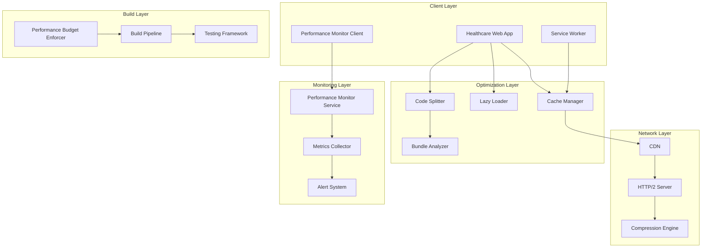

# Design Document: Performance Optimization System

## Overview

The Performance Optimization System is a comprehensive solution designed to ensure optimal performance for a healthcare application where speed and reliability are critical for patient care. The system addresses the unique challenges of healthcare environments, including emergency situations where milliseconds matter, rural areas with limited connectivity, and the need for offline access to critical patient data.

The design implements a multi-layered approach to performance optimization, encompassing code splitting, intelligent caching, network optimization, and continuous monitoring. The system is architected to automatically adapt to different usage patterns, with special consideration for emergency scenarios where critical patient information must be immediately accessible.

Key design principles include:
- **Emergency-first design**: Critical patient data loads with highest priority
- **Adaptive performance**: System adjusts based on network conditions and device capabilities
- **Proactive monitoring**: Continuous performance tracking with automated alerting
- **Progressive enhancement**: Core functionality works on any connection speed
- **Memory efficiency**: Optimized for extended use on various device types

## Architecture

The Performance Optimization System follows a layered architecture with clear separation of concerns:



### Core Components

**Code Splitter**: Responsible for dividing the application into optimally-sized chunks based on routes and functionality. Implements intelligent bundling strategies to minimize duplication while ensuring fast loading.

**Cache Manager**: Multi-tier caching system that coordinates browser cache, service worker cache, and in-memory cache. Implements cache invalidation strategies specific to healthcare data sensitivity.

**Performance Monitor**: Real-time performance tracking system that collects Core Web Vitals, custom metrics, and user experience data. Provides both client-side and server-side monitoring capabilities.

**Lazy Loader**: Intelligent resource loading system that defers non-critical assets while ensuring emergency-critical resources are immediately available.

**Bundle Analyzer**: Continuous analysis tool that monitors bundle sizes, composition, and performance impact. Integrates with the build pipeline to enforce performance budgets.

## Components and Interfaces

### Code Splitter Component

```typescript
interface CodeSplitter {
  splitByRoute(routes: Route[]): ChunkManifest;
  createVendorChunks(dependencies: Dependency[]): VendorChunks;
  optimizeSharedDependencies(chunks: Chunk[]): OptimizedChunks;
  enforceChunkSizeLimit(chunk: Chunk, maxSize: number): boolean;
}

interface ChunkManifest {
  routeChunks: Map<string, Chunk>;
  vendorChunks: VendorChunks;
  commonChunks: Chunk[];
  emergencyChunks: Chunk[];
}
```

### Cache Manager Component

```typescript
interface CacheManager {
  configureBrowserCache(assets: Asset[], duration: Duration): CacheConfig;
  setupServiceWorkerCache(criticalData: CriticalData[]): ServiceWorkerConfig;
  manageInMemoryCache(data: any, ttl: number): CacheEntry;
  invalidateCache(pattern: string): void;
  implementServerPush(resources: Resource[]): PushManifest;
}

interface CacheStrategy {
  type: 'browser' | 'service-worker' | 'memory' | 'server-push';
  ttl: number;
  invalidationRules: InvalidationRule[];
  emergencyOverride: boolean;
}
```

### Performance Monitor Component

```typescript
interface PerformanceMonitor {
  trackCoreWebVitals(): WebVitalsMetrics;
  collectLoadTimeMetrics(): LoadTimeMetrics;
  monitorMemoryUsage(): MemoryMetrics;
  generatePerformanceReport(): PerformanceReport;
  triggerAlert(threshold: Threshold, currentValue: number): void;
}

interface PerformanceMetrics {
  loadTime: number;
  timeToInteractive: number;
  firstContentfulPaint: number;
  cumulativeLayoutShift: number;
  largestContentfulPaint: number;
  firstInputDelay: number;
}
```

### Lazy Loader Component

```typescript
interface LazyLoader {
  deferImageLoading(images: HTMLImageElement[], threshold: number): void;
  loadModuleOnDemand(modulePath: string): Promise<Module>;
  preloadEmergencyComponents(emergencyMode: boolean): void;
  createLoadingPlaceholders(elements: Element[]): Placeholder[];
}

interface LoadingStrategy {
  viewport: ViewportConfig;
  emergencyMode: EmergencyConfig;
  placeholderConfig: PlaceholderConfig;
  preloadRules: PreloadRule[];
}
```

### Bundle Analyzer Component

```typescript
interface BundleAnalyzer {
  analyzeBundleSize(bundles: Bundle[]): BundleAnalysis;
  generateSizeReport(): SizeReport;
  trackSizeTrends(historical: HistoricalData[]): TrendAnalysis;
  enforcePerformanceBudget(budget: PerformanceBudget): BudgetResult;
}

interface BundleAnalysis {
  totalSize: number;
  compressedSize: number;
  composition: ComponentBreakdown[];
  duplicatedCode: DuplicationReport;
  optimizationSuggestions: OptimizationSuggestion[];
}
```

## Data Models

### Performance Budget Model

```typescript
interface PerformanceBudget {
  maxLoadTime: number; // 2000ms for critical pages
  maxBundleSize: number; // 500KB total initial load
  maxImageSize: number; // 100KB per image
  maxHttpRequests: number; // 50 per page
  maxInitialChunkSize: number; // 150KB compressed
  emergencyModeOverrides: EmergencyOverrides;
}

interface EmergencyOverrides {
  allowLargerCriticalBundles: boolean;
  prioritizePatientDataLoading: boolean;
  bypassNonCriticalBudgets: boolean;
}
```

### Cache Configuration Model

```typescript
interface CacheConfiguration {
  staticAssets: {
    duration: number; // 1 year
    compressionLevel: number;
    versioningStrategy: 'hash' | 'timestamp';
  };
  patientData: {
    duration: number; // 15 minutes
    invalidationTriggers: string[];
    emergencyRetention: number; // Extended for emergency mode
  };
  navigationState: {
    memoryLimit: number; // 50MB
    evictionPolicy: 'LRU' | 'LFU';
    sessionPersistence: boolean;
  };
}
```

### Performance Metrics Model

```typescript
interface PerformanceMetrics {
  coreWebVitals: {
    lcp: number; // Largest Contentful Paint
    fid: number; // First Input Delay
    cls: number; // Cumulative Layout Shift
  };
  customMetrics: {
    patientDataLoadTime: number;
    emergencyModeActivationTime: number;
    offlineDataAccessTime: number;
  };
  resourceMetrics: {
    bundleSizes: Map<string, number>;
    networkRequests: NetworkRequest[];
    memoryUsage: MemorySnapshot;
  };
}
```

### Network Optimization Model

```typescript
interface NetworkOptimization {
  connectionType: 'fast' | 'slow' | 'offline';
  adaptiveLoading: {
    imageQuality: number;
    featureFlags: FeatureFlag[];
    deferredComponents: string[];
  };
  requestBatching: {
    batchSize: number;
    batchTimeout: number;
    priorityQueue: RequestPriority[];
  };
  http2Configuration: {
    multiplexing: boolean;
    serverPush: PushResource[];
    streamPrioritization: StreamPriority[];
  };
}
```
### Memory Management Model

```typescript
interface MemoryManagement {
  heapMonitoring: {
    maxHeapSize: number; // 50MB cache limit
    gcTriggerThreshold: number; // 80% of available heap
    leakDetection: boolean;
  };
  componentCleanup: {
    eventListenerCleanup: boolean;
    componentUnmounting: boolean;
    timerCleanup: boolean;
  };
  virtualScrolling: {
    itemHeight: number;
    bufferSize: number;
    maxRenderedItems: number;
  };
}
```

### Emergency Mode Model

```typescript
interface EmergencyMode {
  activationTriggers: {
    userInitiated: boolean;
    systemDetected: boolean;
    contextualCues: string[];
  };
  prioritizedData: {
    patientVitalSigns: boolean;
    allergyInformation: boolean;
    criticalMedications: boolean;
    emergencyContacts: boolean;
  };
  performanceOverrides: {
    bypassLazyLoading: boolean;
    preloadCriticalComponents: boolean;
    extendCacheRetention: boolean;
  };
}
```

## Implementation Strategy

### Phase 1: Core Infrastructure (Weeks 1-3)

**Code Splitting Foundation**
- Implement webpack-based code splitting with route-level chunks
- Configure vendor chunk separation for third-party libraries
- Set up bundle analysis tooling and size monitoring
- Establish chunk size limits and enforcement mechanisms

**Basic Caching Layer**
- Implement browser caching headers for static assets
- Set up service worker for offline functionality
- Configure in-memory caching for navigation state
- Implement cache invalidation strategies

### Phase 2: Performance Monitoring (Weeks 4-5)

**Metrics Collection**
- Integrate Core Web Vitals tracking using web-vitals library
- Implement custom performance metrics for healthcare-specific scenarios
- Set up real user monitoring (RUM) data collection
- Configure performance alerting thresholds

**Dashboard and Reporting**
- Create performance monitoring dashboard
- Implement historical trend analysis
- Set up automated performance regression detection
- Configure deployment impact tracking

### Phase 3: Advanced Optimization (Weeks 6-8)

**Lazy Loading System**
- Implement intersection observer-based image lazy loading
- Set up dynamic module loading for non-critical features
- Configure emergency mode preloading strategies
- Implement loading placeholders and skeleton screens

**Network Optimization**
- Configure HTTP/2 server push for critical resources
- Implement adaptive loading based on connection speed
- Set up request batching and multiplexing
- Configure compression strategies (Brotli/gzip)

### Phase 4: Emergency Mode & Testing (Weeks 9-10)

**Emergency Mode Implementation**
- Develop emergency detection algorithms
- Implement critical data preloading strategies
- Configure performance budget overrides for emergency scenarios
- Set up offline-first architecture for critical functions

**Performance Testing Framework**
- Integrate Lighthouse CI for automated audits
- Implement synthetic performance testing
- Set up performance regression testing
- Configure multi-device and network condition testing

## Error Handling

### Performance Degradation Scenarios

**Bundle Loading Failures**
```typescript
interface BundleLoadingError {
  chunkId: string;
  errorType: 'network' | 'parsing' | 'execution';
  fallbackStrategy: 'retry' | 'graceful-degradation' | 'offline-mode';
  userNotification: boolean;
}
```

**Cache Failures**
- Service worker cache corruption: Implement cache versioning and automatic rebuilding
- Memory cache overflow: Implement LRU eviction with emergency data protection
- Network cache misses: Implement graceful fallback to origin servers

**Performance Budget Violations**
- Build-time enforcement: Fail builds that exceed performance budgets
- Runtime monitoring: Alert on performance degradation with automatic scaling
- Emergency overrides: Allow budget violations for critical healthcare scenarios

**Network Optimization Failures**
- HTTP/2 fallback: Automatic degradation to HTTP/1.1 when needed
- Compression failures: Fallback from Brotli to gzip to uncompressed
- CDN failures: Direct origin server access with performance impact monitoring

### Memory Management Error Handling

**Memory Leak Detection**
```typescript
interface MemoryLeakHandler {
  detectLeaks(): MemoryLeak[];
  forceGarbageCollection(): void;
  cleanupOrphanedReferences(): void;
  notifyDevelopmentTeam(leak: MemoryLeak): void;
}
```

**Out of Memory Scenarios**
- Implement progressive cache clearing starting with least critical data
- Provide user notifications for memory-constrained scenarios
- Maintain emergency data access even under memory pressure

### Emergency Mode Error Handling

**Critical Data Loading Failures**
- Implement multiple fallback data sources for patient information
- Provide offline access to recently cached critical data
- Ensure graceful degradation maintains core healthcare functionality

**Performance Override Failures**
- Implement safety limits even in emergency mode to prevent system crashes
- Provide manual override capabilities for healthcare professionals
- Log all emergency mode activations for audit and optimization

## Testing Strategy

The Performance Optimization System requires a comprehensive testing approach that combines unit testing for specific functionality with property-based testing for performance characteristics across various conditions.

### Unit Testing Approach

**Component-Specific Testing**
- Code Splitter: Test chunk generation, size limits, and dependency management
- Cache Manager: Test cache strategies, invalidation, and emergency overrides
- Performance Monitor: Test metric collection, alerting, and reporting accuracy
- Lazy Loader: Test loading triggers, placeholder generation, and emergency preloading

**Integration Testing**
- End-to-end performance testing across critical healthcare user journeys
- Cross-browser compatibility testing for performance optimizations
- Network condition simulation testing (3G, 4G, WiFi, offline)
- Device capability testing (low-end mobile, tablets, desktop)

**Emergency Scenario Testing**
- Emergency mode activation and deactivation testing
- Critical data preloading under various network conditions
- Performance budget override testing in emergency scenarios
- Offline functionality testing for critical healthcare operations

### Property-Based Testing Configuration

The system will use **fast-check** for JavaScript/TypeScript property-based testing, configured to run a minimum of 100 iterations per property test. Each property test will be tagged with a comment referencing its corresponding design document property using the format: **Feature: performance-optimization, Property {number}: {property_text}**

**Performance Testing Libraries**
- **Lighthouse CI**: Automated performance audits in CI/CD pipeline
- **WebPageTest**: Synthetic performance testing with real browser conditions
- **Artillery**: Load testing for performance under concurrent user scenarios
- **Puppeteer**: Custom performance testing scenarios and metrics collection

**Testing Environment Configuration**
- Minimum 100 iterations for each property-based test due to performance variability
- Network throttling simulation for various connection speeds
- Device emulation for different hardware capabilities
- Memory constraint testing for low-resource scenarios

**Continuous Integration Integration**
- Performance budget enforcement in build pipeline
- Automated performance regression detection
- Performance impact analysis for each deployment
- Emergency mode functionality verification in CI/CD

The dual testing approach ensures both specific performance scenarios are validated through unit tests while universal performance properties are verified across all possible system states through property-based testing.

## Correctness Properties

*A property is a characteristic or behavior that should hold true across all valid executions of a system-essentially, a formal statement about what the system should do. Properties serve as the bridge between human-readable specifications and machine-verifiable correctness guarantees.*

### Property 1: Code Splitting Consistency

*For any* application with multiple routes and dependencies, the code splitter should create separate bundles for each major section, maintain vendor chunks separate from application code, and ensure shared dependencies are never duplicated across chunks.

**Validates: Requirements 1.1, 1.2, 1.5**

### Property 2: Bundle Size Enforcement

*For any* generated bundle or chunk, the system should enforce size limits (250KB for individual chunks, 150KB for initial bundle, 500KB for total initial load) and fail builds that exceed these limits.

**Validates: Requirements 1.4, 4.1, 6.2, 6.3**

### Property 3: Lazy Loading Behavior

*For any* set of images and modules, the lazy loader should defer loading until viewport proximity (200px for images) or user interaction, while providing placeholders to prevent layout shifts.

**Validates: Requirements 2.1, 2.2, 2.3, 2.5**

### Property 4: Emergency Mode Preloading

*For any* emergency mode activation, the system should preload critical patient data components (vital signs, allergies) and prioritize critical path resources while bypassing normal lazy loading constraints.

**Validates: Requirements 2.4, 7.1, 7.3**

### Property 5: Cache Strategy Consistency

*For any* asset or data type, the cache manager should apply appropriate caching strategies (1-year for static assets, 15-minutes for patient data, session-based for navigation state) with proper invalidation rules.

**Validates: Requirements 3.1, 3.2, 3.3, 3.5**

### Property 6: Build Optimization Completeness

*For any* production build, the system should implement tree shaking to eliminate unused code, apply compression (Brotli with gzip fallback), and minify all JavaScript and CSS files.

**Validates: Requirements 4.2, 4.3, 4.4**

### Property 7: Performance Monitoring Coverage

*For any* page load or user session, the performance monitor should collect all required metrics (Load Time, Time to Interactive, First Contentful Paint, Core Web Vitals) and generate alerts when thresholds are exceeded.

**Validates: Requirements 5.1, 5.2, 5.3**

### Property 8: Performance Budget Enforcement

*For any* page or resource, the performance budget system should enforce limits (2-second load time for critical pages, 100KB per image, maximum 50 HTTP requests) and block deployments when violated.

**Validates: Requirements 6.1, 6.4, 6.5**

### Property 9: Critical Path Optimization

*For any* page load, the system should inline critical CSS for above-the-fold content, defer non-critical JavaScript execution until after critical path rendering, and implement appropriate resource hints.

**Validates: Requirements 7.2, 7.4, 7.5**

### Property 10: Adaptive Network Behavior

*For any* detected connection speed, the system should adapt loading strategies (reduce image quality on slow connections, implement request batching, use HTTP/2 multiplexing) while maintaining core functionality through progressive enhancement.

**Validates: Requirements 8.1, 8.2, 8.3, 8.4, 8.5**

### Property 11: Memory Management Efficiency

*For any* application state, the system should automatically cleanup unused components and event listeners, enforce cache size limits (50MB with LRU eviction), and trigger garbage collection optimization when memory usage exceeds 80% of available heap.

**Validates: Requirements 9.1, 9.2, 9.3**

### Property 12: Virtual Scrolling Implementation

*For any* large patient list, the system should implement virtual scrolling to limit DOM nodes and provide memory usage monitoring with leak detection in development mode.

**Validates: Requirements 9.4, 9.5**

### Property 13: Performance Testing Integration

*For any* build or deployment, the system should include automated Lighthouse audits in CI/CD, implement synthetic testing for critical user journeys, and block deployments when performance tests fail predefined thresholds.

**Validates: Requirements 10.1, 10.2, 10.3**

### Property 14: Performance Regression Detection

*For any* build comparison, the system should generate performance regression reports and test performance under various simulated network conditions and device capabilities.

**Validates: Requirements 10.4, 10.5**

### Property 15: Navigation Chunk Loading

*For any* user navigation event, the system should load only the required code chunk for the target route without loading unnecessary bundles.

**Validates: Requirements 1.3**

### Property 16: Server Push Implementation

*For any* critical path resource, the cache manager should implement HTTP/2 server push to optimize initial page load performance.

**Validates: Requirements 3.4**

### Property 17: Bundle Analysis Reporting

*For any* bundle analysis, the system should generate comprehensive reports showing bundle composition, size trends, and optimization recommendations.

**Validates: Requirements 4.5**

### Property 18: Performance Dashboard Functionality

*For any* performance data collection, the system should provide dashboards with historical trend analysis and track performance impact of deployments with before/after comparisons.

**Validates: Requirements 5.4, 5.5**