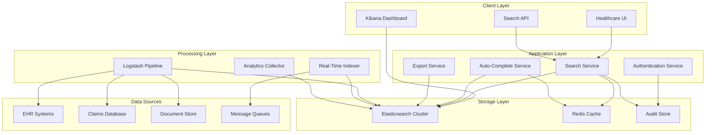

# Design Document: Search and Indexing Service

## Overview

The Search and Indexing Service is a comprehensive healthcare data search platform built on the Elastic Stack (Elasticsearch, Logstash, Kibana). It provides fast, secure, and HIPAA-compliant search capabilities across all healthcare entities including patient records, insurance claims, provider information, and medical documents.

The service architecture follows a microservices pattern with clear separation between data ingestion, search processing, analytics, and user interfaces. The system is designed to handle high-volume healthcare data with sub-second response times while maintaining strict security and compliance requirements.

### Key Features

- **Full-text search** with natural language processing and medical terminology support
- **Real-time indexing** with sub-5-second data availability
- **Faceted navigation** with dynamic filtering capabilities
- **Auto-complete suggestions** with medical term awareness
- **Advanced analytics** through Kibana dashboards
- **HIPAA compliance** with encryption, access controls, and audit logging
- **Multi-entity search** across patient records, claims, providers, and documents
- **Export capabilities** with security controls and audit trails

## Architecture

The Search and Indexing Service follows a layered architecture with the following components:



### Architecture Principles

1. **Scalability**: Horizontal scaling through Elasticsearch clustering and microservice deployment
2. **Reliability**: Multi-node setup with automatic failover and data replication
3. **Security**: End-to-end encryption, role-based access control, and comprehensive auditing
4. **Performance**: Caching strategies, index optimization, and query performance monitoring
5. **Compliance**: HIPAA-compliant data handling with audit trails and access controls

## Components and Interfaces

### Search Service

The core search component that handles query processing and result ranking.

**Responsibilities:**
- Query parsing and validation
- Search execution across multiple indices
- Result ranking and relevance scoring
- Security filtering based on user permissions
- Response formatting and pagination

**Key Interfaces:**
```typescript
interface SearchService {
  search(query: SearchQuery, context: UserContext): Promise<SearchResults>
  explain(query: SearchQuery, documentId: string): Promise<ExplanationResult>
  suggest(partial: string, context: UserContext): Promise<Suggestion[]>
}

interface SearchQuery {
  text: string
  filters: SearchFilter[]
  entityTypes: EntityType[]
  pagination: PaginationOptions
  sorting: SortOptions[]
}

interface SearchResults {
  hits: SearchHit[]
  totalCount: number
  facets: FacetResult[]
  executionTime: number
  suggestions?: string[]
}
```

### Data Ingestion Pipeline

Logstash-based pipeline for processing and indexing healthcare data from multiple sources.

**Responsibilities:**
- Data extraction from source systems
- Format transformation and normalization
- Data validation and quality checks
- Real-time and batch processing
- Error handling and retry logic

**Pipeline Configuration:**
```yaml
input:
  jdbc:
    jdbc_connection_string: "${DB_CONNECTION}"
    jdbc_user: "${DB_USER}"
    jdbc_password: "${DB_PASSWORD}"
    schedule: "*/30 * * * * *"
  
  kafka:
    bootstrap_servers: "${KAFKA_BROKERS}"
    topics: ["patient-updates", "claims-updates"]

filter:
  if [source] == "ehr" {
    json {
      source => "message"
    }
    mutate {
      add_field => { "entity_type" => "patient" }
    }
  }
  
  if [source] == "claims" {
    csv {
      columns => ["claim_id", "patient_id", "amount", "date"]
    }
    mutate {
      add_field => { "entity_type" => "claim" }
    }
  }

output:
  elasticsearch:
    hosts => ["${ES_HOSTS}"]
    index => "healthcare-%{entity_type}-%{+YYYY.MM.dd}"
    template_name => "healthcare"
```

### Real-Time Indexer

Component responsible for immediate indexing of data changes.

**Responsibilities:**
- Change detection through database triggers
- Message queue consumption
- Document transformation and validation
- Index updates and deletions
- Conflict resolution and ordering

**Key Interfaces:**
```typescript
interface RealTimeIndexer {
  indexDocument(document: HealthcareDocument): Promise<IndexResult>
  updateDocument(id: string, updates: Partial<HealthcareDocument>): Promise<IndexResult>
  deleteDocument(id: string): Promise<boolean>
  getIndexingStatus(documentId: string): Promise<IndexingStatus>
}

interface HealthcareDocument {
  id: string
  entityType: EntityType
  content: Record<string, any>
  metadata: DocumentMetadata
  security: SecurityContext
}
```

### Analytics Dashboard

Kibana-based dashboard for search analytics and system monitoring.

**Key Visualizations:**
- Search volume trends and patterns
- Top search terms and zero-result queries
- User behavior analytics and click-through rates
- System performance metrics and error rates
- Security events and access patterns

**Dashboard Components:**
```typescript
interface AnalyticsDashboard {
  searchMetrics: SearchMetricsWidget
  userBehavior: UserBehaviorWidget
  systemHealth: SystemHealthWidget
  securityEvents: SecurityEventsWidget
  customReports: CustomReportWidget[]
}
```

### Auto-Complete Service

Service providing real-time search suggestions and term completion.

**Responsibilities:**
- Suggestion generation from indexed terms
- Medical terminology integration
- Typo tolerance and fuzzy matching
- Popularity-based ranking
- Performance optimization through caching

**Key Interfaces:**
```typescript
interface AutoCompleteService {
  getSuggestions(partial: string, context: UserContext): Promise<Suggestion[]>
  updateSuggestionStats(term: string, selected: boolean): Promise<void>
  refreshSuggestionIndex(): Promise<void>
}

interface Suggestion {
  text: string
  type: SuggestionType
  score: number
  metadata?: Record<string, any>
}
```

## Data Models

### Core Entity Models

**Patient Document:**
```typescript
interface PatientDocument {
  id: string
  mrn: string
  firstName: string
  lastName: string
  dateOfBirth: Date
  gender: string
  address: Address
  phoneNumbers: PhoneNumber[]
  emergencyContacts: Contact[]
  insuranceInfo: InsuranceInfo[]
  medicalHistory: MedicalRecord[]
  allergies: Allergy[]
  medications: Medication[]
  lastUpdated: Date
  createdBy: string
  securityTags: string[]
}
```

**Claims Document:**
```typescript
interface ClaimsDocument {
  id: string
  claimNumber: string
  patientId: string
  providerId: string
  serviceDate: Date
  submissionDate: Date
  amount: number
  status: ClaimStatus
  diagnosisCodes: string[]
  procedureCodes: string[]
  insuranceInfo: InsuranceInfo
  adjudication: AdjudicationInfo
  lastUpdated: Date
  securityTags: string[]
}
```

**Provider Document:**
```typescript
interface ProviderDocument {
  id: string
  npi: string
  firstName: string
  lastName: string
  credentials: string[]
  specialties: Specialty[]
  practiceLocations: Location[]
  contactInfo: ContactInfo
  licenseInfo: LicenseInfo[]
  networkParticipation: NetworkInfo[]
  lastUpdated: Date
  securityTags: string[]
}
```

### Search Configuration Models

**Search Configuration:**
```typescript
interface SearchConfig {
  elasticsearch: ElasticsearchConfig
  logstash: LogstashConfig
  kibana: KibanaConfig
  security: SecurityConfig
  indexing: IndexingConfig
  analytics: AnalyticsConfig
}

interface ElasticsearchConfig {
  hosts: string[]
  clusterName: string
  replicationFactor: number
  shardCount: number
  refreshInterval: string
  compressionType: string
}

interface LogstashConfig {
  inputs: InputConfig[]
  filters: FilterConfig[]
  outputs: OutputConfig[]
  deadLetterQueue: DLQConfig
}
```

### Index Mapping Templates

**Healthcare Entity Template:**
```json
{
  "template": {
    "mappings": {
      "properties": {
        "id": { "type": "keyword" },
        "entity_type": { "type": "keyword" },
        "content": {
          "type": "text",
          "analyzer": "healthcare_analyzer",
          "fields": {
            "keyword": { "type": "keyword" }
          }
        },
        "created_date": { "type": "date" },
        "last_updated": { "type": "date" },
        "security_tags": { "type": "keyword" },
        "department": { "type": "keyword" },
        "provider_id": { "type": "keyword" },
        "patient_id": { "type": "keyword" }
      }
    },
    "settings": {
      "analysis": {
        "analyzer": {
          "healthcare_analyzer": {
            "type": "custom",
            "tokenizer": "standard",
            "filter": [
              "lowercase",
              "healthcare_synonyms",
              "medical_terms"
            ]
          }
        }
      }
    }
  }
}
```

## Correctness Properties

*A property is a characteristic or behavior that should hold true across all valid executions of a system-essentially, a formal statement about what the system should do. Properties serve as the bridge between human-readable specifications and machine-verifiable correctness guarantees.*

### Property 1: Search Response Time Performance

*For any* search query under 1000 characters, the search engine should return results within 200 milliseconds, and filter applications should update results within 100 milliseconds, and auto-complete suggestions should be provided within 50 milliseconds.

**Validates: Requirements 1.2, 6.7, 8.2**

### Property 2: Real-Time Indexing Latency

*For any* healthcare document, new documents should be indexed and searchable within 5 seconds of creation, updates should be searchable within 3 seconds of modification, and all changes should be indexed within 30 seconds regardless of type.

**Validates: Requirements 1.1, 3.4, 9.2, 9.3**

### Property 3: Boolean and Wildcard Query Support

*For any* search query containing boolean operators (AND, OR, NOT), phrase searches with quotation marks, or wildcard operators (* and ?), the search engine should return results that correctly match the specified logical conditions.

**Validates: Requirements 1.3, 1.6**

### Property 4: Fuzzy Search Matching

*For any* search term with up to 2 character differences from indexed content, the search engine should return fuzzy matches, and auto-complete should provide suggestions with typo tolerance.

**Validates: Requirements 1.4, 8.5**

### Property 5: Search Result Formatting

*For any* search results, matching terms should be highlighted with configurable snippet length, and results should include proper entity type identification and metadata.

**Validates: Requirements 1.5, 12.6**

### Property 6: Cross-Entity Search Integration

*For any* search query across multiple entity types, results should be unified and ranked by relevance, and patient searches should include related claims and provider interactions.

**Validates: Requirements 1.7, 12.7**

### Property 7: Data Format Transformation

*For any* input data in HL7 FHIR, JSON, XML, or CSV format, the ingestion pipeline should correctly transform it into searchable documents, and configuration parser should support both JSON and YAML formats.

**Validates: Requirements 3.2, 15.6**

### Property 8: Data Validation and Quality

*For any* input data, the ingestion pipeline should validate data integrity, reject malformed records with detailed error logging, and accept valid records for indexing.

**Validates: Requirements 3.3**

### Property 9: Data Deduplication

*For any* set of input records, the ingestion pipeline should identify and handle duplicates using configurable matching rules, preventing duplicate entries in the search index.

**Validates: Requirements 3.5**

### Property 10: Comprehensive Audit Logging

*For any* search activity, data ingestion operation, or export request, the system should create audit logs with user identification, timestamps, and operation details for compliance tracking.

**Validates: Requirements 3.6, 10.1, 11.3, 13.6**

### Property 11: Error Handling and Retry Logic

*For any* failed operation in ingestion, indexing, or processing, the system should retry up to 3 times with exponential backoff, and route persistently failed documents to dead letter queues.

**Validates: Requirements 3.7, 4.4, 9.7**

### Property 12: Time-Based Index Management

*For any* audit logs and search analytics data, the system should automatically create time-based indices with proper naming conventions and lifecycle management.

**Validates: Requirements 2.5**

### Property 13: Alert Generation

*For any* cluster health degradation, anomaly detection, performance issues, or security events, the system should generate alerts within specified time limits (60 seconds for cluster health, immediate for security events).

**Validates: Requirements 2.7, 5.7, 10.6, 11.7**

### Property 14: Filter Processing and Conditional Logic

*For any* document type and source combination, the ingestion pipeline should apply appropriate filter plugins and conditional processing rules based on document characteristics.

**Validates: Requirements 4.2, 4.5**

### Property 15: Metrics Collection and Reporting

*For any* system operation, processing metrics, performance statistics, and analytics data should be collected and made available for monitoring and reporting purposes.

**Validates: Requirements 4.6, 5.1, 5.2, 5.3, 5.4, 10.2**

### Property 16: Configuration Reload Without Data Loss

*For any* configuration change deployment, the system should reload settings without losing data or interrupting service operations.

**Validates: Requirements 4.7, 15.7**

### Property 17: Analytics Dashboard Functionality

*For any* analytics query with custom date ranges and filtering, the dashboard should provide accurate data visualization and support export in CSV and PDF formats.

**Validates: Requirements 5.5, 5.6**

### Property 18: Faceted Navigation Operations

*For any* search context, faceted navigation should provide accurate filter counts, support multi-select filtering with AND/OR logic, maintain state during pagination, and offer reset functionality.

**Validates: Requirements 6.1, 6.2, 6.3, 6.4, 6.5, 6.6**

### Property 19: Search Relevance and Ranking

*For any* search query, results should be ranked using TF-IDF scoring with healthcare-specific weighting, recency boosting, field-specific boosting for titles and identifiers, and entity-specific scoring rules.

**Validates: Requirements 7.1, 7.2, 7.3, 7.5**

### Property 20: Search Explanation and Debugging

*For any* search result, the system should provide detailed explanation of relevance scores and ranking factors for debugging and optimization purposes.

**Validates: Requirements 7.6**

### Property 21: Auto-Complete Functionality

*For any* user input of 2 or more characters, the auto-complete service should provide relevant suggestions including medical terms, provider names, and healthcare phrases, ranked by popularity and limited to 10 items with configurable length.

**Validates: Requirements 8.1, 8.3, 8.4, 8.6**

### Property 22: Suggestion Selection Tracking

*For any* auto-complete suggestion selection, the system should track selection rates for optimization and ranking improvement.

**Validates: Requirements 8.7**

### Property 23: Document Deletion Handling

*For any* document deletion request, the real-time indexer should immediately remove the document from search results and update related indices.

**Validates: Requirements 9.4**

### Property 24: Indexing Order and Status

*For any* sequence of indexing operations, the system should maintain proper ordering to prevent race conditions and provide accurate indexing status through the monitoring API.

**Validates: Requirements 9.5, 9.6**

### Property 25: Performance Monitoring and Analysis

*For any* search operation, the system should measure response times, identify slow queries and resource-intensive operations, and monitor success rates including zero-result queries.

**Validates: Requirements 10.3, 10.4**

### Property 26: Automated Reporting and Data Archival

*For any* analytics data, the system should generate daily and weekly performance reports and automatically archive historical data when retention limits are reached.

**Validates: Requirements 10.5, 10.7**

### Property 27: Role-Based Access Control

*For any* search request, the system should filter results based on user permissions, mask PHI according to user roles, and validate permissions before processing export requests.

**Validates: Requirements 11.2, 11.4, 13.7**

### Property 28: Data Retention and Purging

*For any* indexed data with retention policies, the system should automatically purge expired records according to configured retention rules.

**Validates: Requirements 11.5**

### Property 29: Multi-Entity Search Support

*For any* healthcare entity type (patients, claims, providers, documents), the system should support indexing, searching, and provide entity-specific interfaces with appropriate filters and fields.

**Validates: Requirements 12.1, 12.3**

### Property 30: Cross-Entity Relationships

*For any* related healthcare entities, the system should support relationship queries and maintain data consistency across entity updates and relationships.

**Validates: Requirements 12.2, 12.4**

### Property 31: Federated Search Capability

*For any* search query across multiple healthcare system databases, the system should provide unified federated search results.

**Validates: Requirements 12.5**

### Property 32: Export Functionality and Security

*For any* search results export request, the system should support CSV, Excel, and PDF formats, limit export size to 10,000 records, include required metadata, apply security controls, and support asynchronous processing for large exports.

**Validates: Requirements 13.1, 13.2, 13.3, 13.4, 13.5**

### Property 33: Query Caching and Performance

*For any* frequently accessed search query, the system should implement caching with configurable TTL and provide cursor-based pagination for large datasets.

**Validates: Requirements 14.1, 14.4**

### Property 34: Performance Profiling and Optimization

*For any* search query, the system should provide profiling information for performance analysis, and automatically trigger optimization routines when performance degrades.

**Validates: Requirements 14.5, 14.7**

### Property 35: Configuration Management Round-Trip

*For any* valid SearchConfig object, parsing then printing then parsing should produce an equivalent object, demonstrating proper serialization and deserialization.

**Validates: Requirements 15.4**

### Property 36: Configuration Parsing and Validation

*For any* configuration file input, the parser should correctly parse valid configurations into SearchConfig objects, return descriptive error messages for invalid configurations, and validate syntax and required fields.

**Validates: Requirements 15.1, 15.2, 15.5**

### Property 37: Configuration Printing

*For any* SearchConfig object, the configuration printer should format it back into a valid configuration file that can be successfully parsed.

**Validates: Requirements 15.3**

## Error Handling

The Search and Indexing Service implements comprehensive error handling across all components to ensure system reliability and data integrity.

### Error Categories

**1. Data Ingestion Errors**
- Malformed data records with detailed validation messages
- Connection failures to source systems with automatic retry
- Transformation errors with dead letter queue routing
- Duplicate detection conflicts with configurable resolution

**2. Search Processing Errors**
- Invalid query syntax with user-friendly error messages
- Timeout errors for long-running queries with partial results
- Index corruption detection with automatic recovery
- Permission denied errors with audit logging

**3. System Infrastructure Errors**
- Elasticsearch cluster failures with automatic failover
- Network connectivity issues with circuit breaker patterns
- Resource exhaustion with graceful degradation
- Configuration errors with validation and rollback

### Error Recovery Strategies

**Retry Mechanisms:**
```typescript
interface RetryConfig {
  maxAttempts: number
  backoffStrategy: 'exponential' | 'linear' | 'fixed'
  baseDelay: number
  maxDelay: number
  jitter: boolean
}

class ErrorHandler {
  async retryWithBackoff<T>(
    operation: () => Promise<T>,
    config: RetryConfig
  ): Promise<T> {
    // Implementation with exponential backoff and jitter
  }
}
```

**Circuit Breaker Pattern:**
```typescript
interface CircuitBreakerConfig {
  failureThreshold: number
  recoveryTimeout: number
  monitoringPeriod: number
}

class CircuitBreaker {
  private state: 'CLOSED' | 'OPEN' | 'HALF_OPEN' = 'CLOSED'
  private failureCount: number = 0
  private lastFailureTime: number = 0
}
```

**Dead Letter Queue Processing:**
```typescript
interface DeadLetterQueue {
  enqueue(document: FailedDocument): Promise<void>
  processRetries(): Promise<ProcessingResult[]>
  getFailedDocuments(filter: DLQFilter): Promise<FailedDocument[]>
}
```

### Monitoring and Alerting

**Health Check Endpoints:**
- `/health/search` - Search service availability
- `/health/ingestion` - Data ingestion pipeline status
- `/health/elasticsearch` - Elasticsearch cluster health
- `/health/dependencies` - External system connectivity

**Alert Conditions:**
- Search response time > 500ms for 5 consecutive minutes
- Indexing lag > 60 seconds for any data source
- Error rate > 5% for any component
- Elasticsearch cluster health degradation
- Security policy violations

## Testing Strategy

The Search and Indexing Service employs a comprehensive dual testing approach combining unit tests for specific scenarios and property-based tests for universal correctness guarantees.

### Property-Based Testing

**Framework Selection:**
- **JavaScript/TypeScript**: fast-check library
- **Java**: jqwik or QuickCheck for Java
- **Python**: Hypothesis library
- **Configuration**: Minimum 100 iterations per property test

**Property Test Implementation:**
Each correctness property from the design document must be implemented as a property-based test with the following tag format:

```typescript
// Feature: search-and-indexing-service, Property 1: Search Response Time Performance
test('search response time performance', async () => {
  await fc.assert(fc.asyncProperty(
    fc.string({ minLength: 1, maxLength: 999 }), // Query under 1000 chars
    async (query) => {
      const startTime = Date.now()
      const results = await searchService.search({ text: query })
      const responseTime = Date.now() - startTime
      
      expect(responseTime).toBeLessThan(200) // 200ms requirement
      expect(results).toBeDefined()
    }
  ), { numRuns: 100 })
})
```

**Test Data Generation:**
```typescript
// Healthcare-specific generators
const patientGenerator = fc.record({
  id: fc.uuid(),
  mrn: fc.string({ minLength: 8, maxLength: 12 }),
  firstName: fc.string({ minLength: 2, maxLength: 50 }),
  lastName: fc.string({ minLength: 2, maxLength: 50 }),
  dateOfBirth: fc.date({ min: new Date('1900-01-01'), max: new Date() })
})

const searchQueryGenerator = fc.record({
  text: fc.string({ minLength: 1, maxLength: 1000 }),
  filters: fc.array(filterGenerator),
  entityTypes: fc.array(fc.constantFrom('patient', 'claim', 'provider'))
})
```

### Unit Testing

**Focus Areas:**
- Specific examples demonstrating correct behavior
- Edge cases and boundary conditions
- Error conditions and exception handling
- Integration points between components
- Security and access control scenarios

**Test Categories:**

**1. Search Functionality Tests**
```typescript
describe('Search Service', () => {
  test('should return empty results for non-existent terms', async () => {
    const results = await searchService.search({ text: 'nonexistentterm12345' })
    expect(results.hits).toHaveLength(0)
    expect(results.totalCount).toBe(0)
  })
  
  test('should handle special characters in queries', async () => {
    const results = await searchService.search({ text: 'patient@#$%' })
    expect(results).toBeDefined()
    expect(results.executionTime).toBeLessThan(200)
  })
})
```

**2. Data Ingestion Tests**
```typescript
describe('Data Ingestion Pipeline', () => {
  test('should reject malformed HL7 FHIR documents', async () => {
    const malformedDocument = { invalid: 'structure' }
    
    await expect(
      ingestionPipeline.process(malformedDocument)
    ).rejects.toThrow('Invalid FHIR document structure')
  })
  
  test('should handle duplicate patient records', async () => {
    const patient1 = createTestPatient({ mrn: 'MRN123' })
    const patient2 = createTestPatient({ mrn: 'MRN123' })
    
    await ingestionPipeline.process(patient1)
    const result = await ingestionPipeline.process(patient2)
    
    expect(result.action).toBe('deduplicated')
    expect(result.existingDocumentId).toBe(patient1.id)
  })
})
```

**3. Security and Compliance Tests**
```typescript
describe('Security Controls', () => {
  test('should mask PHI for unauthorized users', async () => {
    const limitedUser = createUserContext({ role: 'limited' })
    const results = await searchService.search(
      { text: 'patient data' },
      limitedUser
    )
    
    results.hits.forEach(hit => {
      expect(hit.content.ssn).toMatch(/\*\*\*-\*\*-\d{4}/)
      expect(hit.content.dateOfBirth).toBeUndefined()
    })
  })
  
  test('should audit all search activities', async () => {
    const user = createUserContext({ userId: 'user123' })
    await searchService.search({ text: 'test query' }, user)
    
    const auditLogs = await auditService.getRecentLogs()
    expect(auditLogs).toContainEqual(
      expect.objectContaining({
        userId: 'user123',
        action: 'search',
        query: 'test query',
        timestamp: expect.any(Date)
      })
    )
  })
})
```

### Integration Testing

**End-to-End Scenarios:**
- Complete data flow from source systems to search results
- Multi-user concurrent access with different permission levels
- Failover scenarios with cluster node failures
- Performance testing under realistic load conditions

**Test Environment Setup:**
```yaml
# docker-compose.test.yml
version: '3.8'
services:
  elasticsearch-test:
    image: elasticsearch:8.11.0
    environment:
      - discovery.type=single-node
      - xpack.security.enabled=false
    
  logstash-test:
    image: logstash:8.11.0
    volumes:
      - ./test/logstash.conf:/usr/share/logstash/pipeline/logstash.conf
    
  test-runner:
    build: .
    environment:
      - ES_HOST=elasticsearch-test:9200
      - TEST_MODE=integration
    depends_on:
      - elasticsearch-test
      - logstash-test
```

### Performance Testing

**Load Testing Scenarios:**
- 1000 concurrent users performing searches
- High-volume data ingestion (10,000 documents/minute)
- Large result set pagination and export
- Complex multi-entity relationship queries

**Performance Benchmarks:**
- Search response time: < 200ms (95th percentile)
- Indexing latency: < 5 seconds for new documents
- Auto-complete response: < 50ms (99th percentile)
- Export generation: < 30 seconds for 10,000 records

The testing strategy ensures comprehensive coverage of both functional correctness through property-based testing and practical reliability through targeted unit and integration tests.