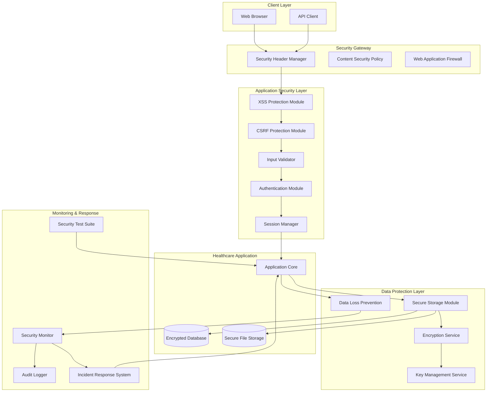

# Security Hardening System Design

## Overview

The Security Hardening System provides comprehensive protection for a healthcare application that processes Protected Health Information (PHI), insurance claims, and provider data. This system implements defense-in-depth security measures to prevent common web vulnerabilities, protect sensitive data, and maintain HIPAA compliance.

The system addresses ten critical security domains: XSS protection, CSRF prevention, secure data storage, input validation, security headers, authentication and session security, security monitoring and logging, security testing and vulnerability management, data loss prevention, and incident response and recovery.

### Key Design Principles

- **Defense in Depth**: Multiple layers of security controls to prevent single points of failure
- **Zero Trust Architecture**: Verify every request and user regardless of location or previous authentication
- **Compliance by Design**: Built-in HIPAA compliance with audit trails and data protection
- **Automated Security**: Continuous monitoring, testing, and incident response capabilities
- **Least Privilege**: Minimal access rights for users and systems based on role requirements

## Architecture

The Security Hardening System follows a modular architecture with specialized components for each security domain. The system integrates with the existing healthcare application through middleware, interceptors, and security filters.



### Security Zones

1. **Perimeter Security**: WAF, security headers, and initial request filtering
2. **Application Security**: Input validation, XSS/CSRF protection, authentication
3. **Data Security**: Encryption, secure storage, key management
4. **Monitoring Security**: Logging, monitoring, incident response

## Components and Interfaces

### XSS Protection Module

**Purpose**: Prevents Cross-Site Scripting attacks through input sanitization and output encoding.

**Key Interfaces**:
- `sanitizeInput(input: string, context: SecurityContext): string`
- `encodeOutput(content: string, outputContext: OutputContext): string`
- `validateContentSecurityPolicy(policy: CSPPolicy): boolean`

**Implementation Details**:
- Context-aware output encoding (HTML, JavaScript, CSS, URL)
- HTML sanitization using allowlist-based filtering
- Integration with Content Security Policy enforcement
- File upload validation and malware scanning

### CSRF Protection Module

**Purpose**: Prevents Cross-Site Request Forgery attacks through token validation and SameSite cookies.

**Key Interfaces**:
- `generateCSRFToken(sessionId: string): string`
- `validateCSRFToken(token: string, sessionId: string): boolean`
- `rotateToken(sessionId: string): string`

**Implementation Details**:
- Cryptographically secure token generation using 256-bit entropy
- Token validation for all state-changing operations
- SameSite cookie attributes (Strict/Lax based on context)
- Automatic token rotation on authentication events

### Secure Storage Module

**Purpose**: Provides encrypted storage for PHI and sensitive data with key management.

**Key Interfaces**:
- `encryptData(data: PHIData, keyId: string): EncryptedData`
- `decryptData(encryptedData: EncryptedData, keyId: string): PHIData`
- `rotateEncryptionKey(keyId: string): string`

**Implementation Details**:
- AES-256-GCM encryption for data at rest
- TLS 1.3 for data in transit
- Hardware Security Module (HSM) integration for key storage
- Automated key rotation every 90 days
- Separate key storage from encrypted data

### Input Validator

**Purpose**: Validates and sanitizes all user inputs to prevent injection attacks.

**Key Interfaces**:
- `validateInput(input: any, schema: ValidationSchema): ValidationResult`
- `sanitizeInput(input: string, inputType: InputType): string`
- `validateFileUpload(file: FileUpload): FileValidationResult`

**Implementation Details**:
- Schema-based validation using JSON Schema
- Whitelist-based input filtering
- Parameterized query enforcement for SQL operations
- File signature verification and malware scanning
- Input length and complexity limits

### Security Header Manager

**Purpose**: Configures and manages HTTP security headers for browser-based protection.

**Key Interfaces**:
- `setSecurityHeaders(response: HttpResponse): void`
- `configureCSP(policy: CSPDirectives): void`
- `updateHSTSPolicy(maxAge: number, includeSubdomains: boolean): void`

**Implementation Details**:
- Strict-Transport-Security with 1-year max-age
- X-Frame-Options set to DENY
- X-Content-Type-Options set to nosniff
- Restrictive Content-Security-Policy
- Referrer-Policy set to strict-origin-when-cross-origin

### Authentication Module

**Purpose**: Handles secure user authentication with multi-factor authentication support.

**Key Interfaces**:
- `authenticateUser(credentials: UserCredentials): AuthenticationResult`
- `enableMFA(userId: string, mfaMethod: MFAMethod): void`
- `validateMFA(userId: string, mfaToken: string): boolean`

**Implementation Details**:
- Multi-factor authentication for PHI access
- Progressive authentication delays
- Account lockout after 5 failed attempts
- Integration with enterprise identity providers
- Cryptographically secure password hashing (Argon2id)

### Session Manager

**Purpose**: Manages secure user sessions with automatic timeout and invalidation.

**Key Interfaces**:
- `createSession(userId: string): SessionToken`
- `validateSession(token: SessionToken): SessionValidationResult`
- `invalidateSession(token: SessionToken): void`

**Implementation Details**:
- 128-bit entropy session identifiers
- 15-minute inactivity timeout
- Secure session storage with encryption
- Session invalidation on logout/timeout
- Session fixation protection

### Audit Logger

**Purpose**: Provides tamper-evident logging for security events and compliance.

**Key Interfaces**:
- `logSecurityEvent(event: SecurityEvent): void`
- `logPHIAccess(userId: string, phiId: string, action: AccessAction): void`
- `generateAuditReport(criteria: AuditCriteria): AuditReport`

**Implementation Details**:
- Cryptographic integrity protection for logs
- Structured logging with standardized formats
- 6-year log retention for HIPAA compliance
- Real-time log correlation and analysis
- Tamper detection and alerting

### Security Monitor

**Purpose**: Monitors system security in real-time and detects anomalous behavior.

**Key Interfaces**:
- `detectAnomalies(events: SecurityEvent[]): Anomaly[]`
- `generateAlert(anomaly: Anomaly): SecurityAlert`
- `correlateEvents(timeWindow: TimeRange): CorrelationResult`

**Implementation Details**:
- Machine learning-based anomaly detection
- Real-time event correlation
- Behavioral analysis for PHI access patterns
- Integration with SIEM systems
- Automated threat intelligence feeds

### Incident Response System

**Purpose**: Automates incident response and recovery procedures.

**Key Interfaces**:
- `detectIncident(events: SecurityEvent[]): IncidentAssessment`
- `executePlaybook(incident: SecurityIncident): PlaybookExecution`
- `isolateSystem(systemId: string): IsolationResult`

**Implementation Details**:
- Automated system isolation capabilities
- Incident classification and prioritization
- Playbook-driven response workflows
- Evidence preservation and chain of custody
- Regulatory notification automation

### Data Loss Prevention Module

**Purpose**: Monitors and prevents unauthorized data exfiltration.

**Key Interfaces**:
- `classifyData(data: any): DataClassification`
- `monitorDataAccess(userId: string, dataId: string): AccessMonitoringResult`
- `preventDataExfiltration(request: DataRequest): PreventionResult`

**Implementation Details**:
- Content-based data classification
- Network-level monitoring and blocking
- Behavioral analysis for data access patterns
- Bulk download authorization requirements
- Removable media encryption and logging

## Data Models

### Security Event Model

```typescript
interface SecurityEvent {
  eventId: string;
  timestamp: Date;
  eventType: SecurityEventType;
  severity: SecuritySeverity;
  userId?: string;
  sessionId?: string;
  sourceIP: string;
  userAgent?: string;
  resource: string;
  action: string;
  result: EventResult;
  details: Record<string, any>;
  signature: string; // Cryptographic integrity protection
}

enum SecurityEventType {
  AUTHENTICATION = 'authentication',
  AUTHORIZATION = 'authorization',
  PHI_ACCESS = 'phi_access',
  DATA_MODIFICATION = 'data_modification',
  SECURITY_VIOLATION = 'security_violation',
  SYSTEM_EVENT = 'system_event'
}

enum SecuritySeverity {
  LOW = 'low',
  MEDIUM = 'medium',
  HIGH = 'high',
  CRITICAL = 'critical'
}
```

### PHI Data Model

```typescript
interface PHIData {
  phiId: string;
  patientId: string;
  dataType: PHIDataType;
  classification: DataClassification;
  encryptedContent: EncryptedData;
  keyId: string;
  createdAt: Date;
  lastAccessed: Date;
  accessCount: number;
  retentionPolicy: RetentionPolicy;
}

interface EncryptedData {
  algorithm: string; // AES-256-GCM
  ciphertext: Buffer;
  iv: Buffer;
  authTag: Buffer;
  keyVersion: number;
}

enum DataClassification {
  PUBLIC = 'public',
  INTERNAL = 'internal',
  CONFIDENTIAL = 'confidential',
  PHI = 'phi',
  HIGHLY_SENSITIVE = 'highly_sensitive'
}
```

### Session Model

```typescript
interface UserSession {
  sessionId: string;
  userId: string;
  createdAt: Date;
  lastActivity: Date;
  expiresAt: Date;
  ipAddress: string;
  userAgent: string;
  mfaVerified: boolean;
  permissions: Permission[];
  csrfToken: string;
  isActive: boolean;
}

interface Permission {
  resource: string;
  actions: string[];
  conditions?: AccessCondition[];
}
```

### Incident Model

```typescript
interface SecurityIncident {
  incidentId: string;
  severity: IncidentSeverity;
  status: IncidentStatus;
  type: IncidentType;
  detectedAt: Date;
  description: string;
  affectedSystems: string[];
  affectedUsers: string[];
  containmentActions: ContainmentAction[];
  evidence: Evidence[];
  timeline: IncidentEvent[];
  assignedTo?: string;
  resolvedAt?: Date;
}

enum IncidentSeverity {
  LOW = 'low',
  MEDIUM = 'medium',
  HIGH = 'high',
  CRITICAL = 'critical'
}

enum IncidentStatus {
  DETECTED = 'detected',
  INVESTIGATING = 'investigating',
  CONTAINED = 'contained',
  RESOLVED = 'resolved',
  CLOSED = 'closed'
}
```

### Vulnerability Model

```typescript
interface SecurityVulnerability {
  vulnerabilityId: string;
  cveId?: string;
  title: string;
  description: string;
  severity: VulnerabilitySeverity;
  cvssScore: number;
  affectedComponents: string[];
  discoveredAt: Date;
  status: VulnerabilityStatus;
  remediationPlan?: RemediationPlan;
  dueDate?: Date;
  verifiedAt?: Date;
}

enum VulnerabilitySeverity {
  LOW = 'low',
  MEDIUM = 'medium',
  HIGH = 'high',
  CRITICAL = 'critical'
}

interface RemediationPlan {
  steps: RemediationStep[];
  estimatedEffort: number;
  assignedTo: string;
  priority: number;
}
```

## Correctness Properties

*A property is a characteristic or behavior that should hold true across all valid executions of a system-essentially, a formal statement about what the system should do. Properties serve as the bridge between human-readable specifications and machine-verifiable correctness guarantees.*

### Property 1: Input Sanitization and Validation

*For any* user input received by the system, the Input_Validator should sanitize HTML content, escape special characters, validate against defined schemas, implement whitelist-based filtering, and enforce length and complexity limits.

**Validates: Requirements 1.1, 4.1, 4.2, 4.4**

### Property 2: Context-Aware Output Encoding

*For any* dynamic content being rendered, the XSS_Protection_Module should encode the output appropriately based on the rendering context (HTML, JavaScript, CSS, URL).

**Validates: Requirements 1.2**

### Property 3: XSS Prevention Mechanisms

*For any* XSS attack payload (reflected or stored), the XSS_Protection_Module should prevent the execution of malicious scripts through sanitization and encoding.

**Validates: Requirements 1.5**

### Property 4: File Upload Security Validation

*For any* file upload, the system should validate file types, verify file signatures, scan for malicious content and malware, ensuring only safe files are processed.

**Validates: Requirements 1.4, 4.5**

### Property 5: CSRF Token Uniqueness and Validation

*For any* user session, the CSRF_Protection_Module should generate unique tokens and validate them for all state-changing requests, rejecting invalid tokens and logging security events.

**Validates: Requirements 2.1, 2.2, 2.4**

### Property 6: CSRF Token Rotation

*For any* authentication or privilege escalation event, the CSRF_Protection_Module should rotate the CSRF token to prevent token reuse attacks.

**Validates: Requirements 2.5**

### Property 7: Data Encryption at Rest and in Transit

*For any* PHI or sensitive data, the Secure_Storage_Module should encrypt the data using AES-256 at rest and use end-to-end encryption during transmission.

**Validates: Requirements 3.1, 3.4**

### Property 8: Encryption Key Rotation

*For any* encryption key, the Secure_Storage_Module should rotate keys within 90 days and maintain proper key lifecycle management.

**Validates: Requirements 3.3**

### Property 9: SQL Injection Prevention

*For any* SQL query construction, the Healthcare_System should use parameterized queries to prevent SQL injection attacks.

**Validates: Requirements 4.3**

### Property 10: Multi-Factor Authentication Enforcement

*For any* user account with PHI access, the Healthcare_System should enforce multi-factor authentication during the authentication process.

**Validates: Requirements 6.1**

### Property 11: Authentication Security Controls

*For any* authentication attempt, the Healthcare_System should implement progressive delays for failures and account lockout after 5 failed attempts.

**Validates: Requirements 6.3**

### Property 12: Session Security Management

*For any* user session, the Healthcare_System should generate cryptographically secure identifiers with minimum 128 bits of entropy, implement 15-minute inactivity timeout, and properly invalidate sessions on logout or expiration.

**Validates: Requirements 6.2, 6.4, 6.5**

### Property 13: Comprehensive Security Event Logging

*For any* security event (authentication, PHI access, administrative actions), the Audit_Logger should log the event with tamper-evident cryptographic integrity protection.

**Validates: Requirements 7.1, 7.2**

### Property 14: Real-Time Security Alerting

*For any* suspicious activity detected by the system, the Healthcare_System should generate real-time alerts for security personnel.

**Validates: Requirements 7.3**

### Property 15: Attack Pattern Detection and Correlation

*For any* sequence of security events, the Healthcare_System should perform log correlation and analysis to detect attack patterns and anomalies.

**Validates: Requirements 7.5**

### Property 16: Automated Vulnerability Scanning

*For any* code deployment, the Security_Test_Suite should perform automated vulnerability scans and report findings.

**Validates: Requirements 8.1**

### Property 17: Vulnerability Prioritization

*For any* discovered vulnerability, the Healthcare_System should prioritize remediation based on CVSS scores and data sensitivity levels.

**Validates: Requirements 8.3**

### Property 18: Critical Vulnerability Remediation Timing

*For any* critical vulnerability, the Healthcare_System should ensure remediation within 30 days of discovery.

**Validates: Requirements 8.5**

### Property 19: PHI Access Monitoring and Anomaly Detection

*For any* PHI access operation, the Healthcare_System should monitor access patterns, log the activity, and detect anomalous behavior.

**Validates: Requirements 9.1**

### Property 20: Data Classification and Protection Controls

*For any* data processed by the system, the Healthcare_System should classify the data by sensitivity level and apply appropriate protection controls.

**Validates: Requirements 9.2**

### Property 21: Bulk Data Export Authorization

*For any* bulk PHI download attempt, the Healthcare_System should require additional authorization beyond standard access controls.

**Validates: Requirements 9.3**

### Property 22: Network-Level Data Loss Prevention

*For any* data transmission attempt, the Healthcare_System should monitor network traffic and block unauthorized data exfiltration.

**Validates: Requirements 9.4**

### Property 23: Removable Media Security

*For any* removable media usage, the Healthcare_System should encrypt all data and maintain comprehensive access logs.

**Validates: Requirements 9.5**

### Property 24: Automated Incident Response

*For any* detected security incident, the Healthcare_System should automatically isolate affected systems and preserve evidence for investigation.

**Validates: Requirements 10.1**

### Property 25: Backup and Recovery Performance

*For any* system failure requiring recovery, the Healthcare_System should restore operations within the 4-hour recovery time objective while maintaining data integrity.

**Validates: Requirements 10.2**

### Property 26: Breach Notification and Reporting

*For any* confirmed security breach, the Healthcare_System should generate incident reports and notify required parties within regulatory timeframes.

**Validates: Requirements 10.3**

### Property 27: Incident Response Playbook Execution

*For any* security incident, the Healthcare_System should execute appropriate incident response playbooks with automated workflow processing.

**Validates: Requirements 10.4**

### Property 28: Post-Incident Analysis and Improvement

*For any* resolved security incident, the Healthcare_System should perform analysis and implement lessons learned to prevent recurrence.

**Validates: Requirements 10.5**

## Error Handling

The Security Hardening System implements comprehensive error handling to maintain security posture even during failure conditions:

### Security-First Error Handling Principles

1. **Fail Secure**: All security controls default to deny/block when errors occur
2. **No Information Leakage**: Error messages never expose sensitive system information
3. **Audit All Failures**: Security-related errors are logged for investigation
4. **Graceful Degradation**: System maintains core security functions during partial failures

### Error Categories and Handling

#### Authentication and Authorization Errors

- **Invalid Credentials**: Log attempt, implement progressive delays, return generic error message
- **Session Timeout**: Invalidate session, redirect to login, log security event
- **Insufficient Privileges**: Log unauthorized access attempt, return access denied message
- **MFA Failures**: Lock account after threshold, log security event, notify administrators

#### Input Validation Errors

- **Malicious Input Detected**: Block request, log security event, return sanitized error response
- **Schema Validation Failures**: Reject input, log validation error, return field-specific guidance
- **File Upload Errors**: Quarantine suspicious files, log security event, notify administrators
- **Size Limit Exceeded**: Reject upload, log attempt, return size limit information

#### Encryption and Data Protection Errors

- **Key Management Failures**: Fail secure, log critical error, trigger key rotation procedures
- **Encryption/Decryption Errors**: Block data access, log security event, initiate incident response
- **Data Integrity Violations**: Quarantine affected data, log critical error, notify security team
- **HSM Communication Failures**: Switch to backup key store, log critical error, alert administrators

#### Network and Communication Errors

- **TLS Handshake Failures**: Block connection, log security event, require secure retry
- **Certificate Validation Errors**: Reject connection, log security event, notify administrators
- **DLP Policy Violations**: Block transmission, log security event, notify data protection officer
- **Network Anomalies**: Isolate affected systems, log security event, initiate investigation

#### Monitoring and Logging Errors

- **Log Tampering Detected**: Trigger incident response, preserve evidence, notify security team
- **Audit System Failures**: Switch to backup logging, log critical error, alert administrators
- **SIEM Integration Errors**: Maintain local logging, log integration failure, retry connection
- **Alert System Failures**: Use backup notification channels, log system error, escalate to management

### Error Recovery Procedures

#### Automated Recovery

- **Service Restart**: Automatic restart with exponential backoff for transient failures
- **Failover**: Automatic failover to backup systems for critical security services
- **Circuit Breaker**: Temporary service isolation to prevent cascade failures
- **Self-Healing**: Automatic configuration correction for known error conditions

#### Manual Recovery

- **Incident Response**: Structured response procedures for security-related errors
- **Key Recovery**: Manual key restoration procedures for cryptographic failures
- **Data Recovery**: Secure data restoration from encrypted backups
- **System Restoration**: Complete system rebuild procedures for compromise scenarios

## Testing Strategy

The Security Hardening System employs a comprehensive dual testing approach combining unit tests for specific scenarios and property-based tests for universal validation.

### Testing Philosophy

- **Security-First Testing**: All tests prioritize security validation over functional convenience
- **Comprehensive Coverage**: Both positive and negative test cases for all security controls
- **Realistic Attack Simulation**: Tests include actual attack vectors and payloads
- **Compliance Validation**: Tests verify HIPAA and regulatory requirement compliance

### Unit Testing Strategy

Unit tests focus on specific security scenarios, edge cases, and integration points:

#### Security Control Validation
- **XSS Protection**: Test specific XSS payloads and encoding scenarios
- **CSRF Protection**: Test token generation, validation, and rotation edge cases
- **Input Validation**: Test boundary conditions and malicious input patterns
- **Authentication**: Test MFA flows, lockout scenarios, and session edge cases

#### Integration Testing
- **Security Header Integration**: Verify headers are properly set across all endpoints
- **Encryption Integration**: Test key management and HSM integration points
- **Logging Integration**: Verify audit logs are properly generated and protected
- **Monitoring Integration**: Test alert generation and incident response triggers

#### Compliance Testing
- **HIPAA Compliance**: Verify PHI protection and audit trail requirements
- **Regulatory Requirements**: Test breach notification and reporting procedures
- **Data Retention**: Verify log retention and secure deletion procedures
- **Access Controls**: Test role-based access and privilege escalation prevention

### Property-Based Testing Strategy

Property-based tests verify universal security properties across all possible inputs using fast-check library for JavaScript/TypeScript:

#### Configuration Requirements
- **Minimum 100 iterations** per property test to ensure comprehensive input coverage
- **Deterministic seeding** for reproducible test results
- **Shrinking enabled** to find minimal failing examples
- **Custom generators** for security-relevant data types (PHI, credentials, tokens)

#### Property Test Categories

**Input Security Properties**
```typescript
// Feature: security-hardening, Property 1: Input Sanitization and Validation
// For any user input, sanitization should remove malicious content
fc.property(fc.string(), (input) => {
  const sanitized = inputValidator.sanitizeInput(input, SecurityContext.HTML);
  return !containsMaliciousContent(sanitized);
});
```

**Cryptographic Properties**
```typescript
// Feature: security-hardening, Property 7: Data Encryption at Rest and in Transit
// For any PHI data, encryption should be reversible and secure
fc.property(fc.record({...}), (phiData) => {
  const encrypted = secureStorage.encryptData(phiData, keyId);
  const decrypted = secureStorage.decryptData(encrypted, keyId);
  return deepEqual(phiData, decrypted) && isSecurelyEncrypted(encrypted);
});
```

**Session Security Properties**
```typescript
// Feature: security-hardening, Property 12: Session Security Management
// For any session, identifiers should be unique and properly managed
fc.property(fc.array(fc.record({...}), {minLength: 2}), (sessions) => {
  const sessionIds = sessions.map(s => sessionManager.createSession(s.userId));
  return allUnique(sessionIds) && allHaveMinimumEntropy(sessionIds, 128);
});
```

**Access Control Properties**
```typescript
// Feature: security-hardening, Property 19: PHI Access Monitoring
// For any PHI access, monitoring should detect and log the activity
fc.property(fc.record({...}), (accessRequest) => {
  const result = phiAccessMonitor.monitorAccess(accessRequest);
  return result.logged && result.analyzed && result.classified;
});
```

### Security Testing Tools and Frameworks

#### Static Analysis
- **ESLint Security Plugin**: Detect security anti-patterns in code
- **Semgrep**: Custom rules for healthcare security requirements
- **SonarQube**: Security hotspot detection and code quality analysis
- **Bandit**: Python security linting for backend components

#### Dynamic Analysis
- **OWASP ZAP**: Automated web application security testing
- **Burp Suite**: Manual penetration testing and vulnerability assessment
- **SQLMap**: SQL injection testing for database interactions
- **Nmap**: Network security scanning and service enumeration

#### Dependency Security
- **npm audit**: Node.js dependency vulnerability scanning
- **Snyk**: Comprehensive dependency and container security scanning
- **OWASP Dependency Check**: Known vulnerability detection in dependencies
- **GitHub Security Advisories**: Automated vulnerability alerts and updates

### Continuous Security Testing

#### CI/CD Integration
- **Pre-commit Hooks**: Security linting and basic vulnerability checks
- **Build Pipeline**: Automated security testing on every commit
- **Deployment Gates**: Security approval required before production deployment
- **Post-deployment**: Continuous monitoring and vulnerability assessment

#### Security Test Automation
- **Scheduled Scans**: Daily vulnerability scans and weekly penetration tests
- **Regression Testing**: Security test suite execution on every release
- **Performance Testing**: Security control performance under load
- **Chaos Engineering**: Security resilience testing under failure conditions

### Test Data Management

#### Synthetic Test Data
- **PHI Simulation**: Realistic but synthetic patient data for testing
- **Attack Payload Libraries**: Comprehensive XSS, SQL injection, and other attack vectors
- **User Behavior Simulation**: Realistic user interaction patterns for anomaly detection testing
- **Compliance Scenarios**: Test cases covering all regulatory requirements

#### Test Environment Security
- **Isolated Testing**: Separate test environments with production-equivalent security
- **Data Masking**: Real data anonymization for realistic testing scenarios
- **Secure Test Credentials**: Dedicated test accounts with appropriate privileges
- **Environment Cleanup**: Secure deletion of test data after test completion